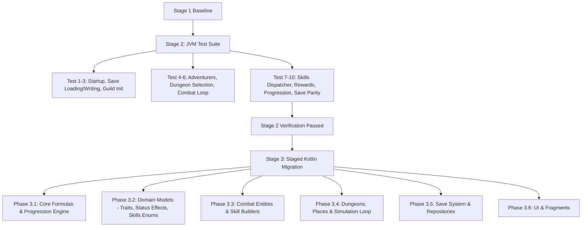

# Implementation Plan: Stage 2 (Functional Parity Verification) & Stage 3 (Kotlin Migration)

Reconstruct and verify Idle Guild Master (base v2.148) in `C:\Repositories\IGM-Modded`. Having achieved a clean compiling baseline in Stage 1, we now establish automated verification of the 10 core vanilla systems (Stage 2), followed by a staged migration to idiomatic Kotlin according to the target architecture (Stage 3).

---

## User Review Required

> [!IMPORTANT]
> **Stage 2 Verification Strategy**: We propose verifying functional parity via JVM unit and integration tests (`app/src/test/`) that exercise the complete headless simulation loop (data initialization, adventurer generation, combat ticks, skill casting, and save serialization). This runs rapidly in ~5 seconds on every build without requiring an attached Android device.

> [!IMPORTANT]
> **Stage 3 Kotlin Interop Strategy**: To preserve existing references across ~1,100 Java classes while migrating to idiomatic Kotlin, we will use Kotlin package structures matching the target architecture (`domain/`, `game/`, `data/`) while providing `@JvmStatic` / `@JvmOverloads` / typealias or package-level facades so that existing Java callers compile without code breakage.

---

## Proposed Phases



---

## Stage 2: Functional Parity Verification

We will create a comprehensive JVM test suite under `app/src/test/java/it/paranoidsquirrels/idleguildmaster/` verifying the 10 major systems specified in the user requirements:

### 1. Application Startup & Guild Initialization
- Validate `new Data()` generates exact initial state:
  - All 24 areas instantiated (`EnchantedForest` to `TheTower`).
  - `EnchantedForest.isUnlocked() == true`, all others locked.
  - Starting tutorial step = 1, initial message queues (`KingMessage.MESSAGE_1`), default settings.
  - Initial seen items list matches vanilla.

### 2. Save Loading & Writing Round-Trip
- Validate JSON serialization via `FileManager.initGson()` / `DataDeserializer`.
- Verify serializing a live `Data` instance to JSON and deserializing back produces an identical data tree with zero field loss.

### 3. Adventurer Creation (Tavern System)
- Verify `Utils.rollTavernAdventurer()`:
  - Generates valid adventurers with rolled classes (`Footman`, `Rogue`, `Archer`, `Apprentice`).
  - Correct weapon assignment matching class weapon type.
  - Generates valid common & rare traits.
  - Enforces tavern capacity (`Formulas.getTavernCapacity()`).

### 4. Dungeon Selection & Exploration Setup
- Assign adventurers to `EnchantedForest` (`setAdventurersExploringIds`).
- Validate `setupArea()` and `setupAdventurers()` populates exploration party and initializes fighting group.

### 5. Combat Simulation & Turn Progression
- Execute multiple `Area.tick()` and `Area.performAction()` cycles:
  - Verify room transitions: Action 0 (`enter_dungeon`) -> Action 1 (`enterRoom`) -> Action 2 (`fightTurn`).
  - Verify enemy spawning (`rollEnemies()`), turn counter increments, and team alive checks.
  - Verify physical & magic damage calculation, armor ignore, and dodge/hit quest hooks.

### 6. Active Skills Dispatcher (`Area.cast(Entity)`)
- Test casting across various active skills from the 100 reconstructed bytecode cases:
  - Single target attack: `ACTIVE_MIGHTY_STRIKE` (2.0x amp).
  - Multi-target attacks: `ACTIVE_BARRAGE_I` (2 hits), `ACTIVE_BARRAGE_IV` (5 hits), `ACTIVE_DECIMATE_I` (all enemies + stun).
  - Multi-execute chains: `ACTIVE_FOCUSED_BARRAGE` (0.5x + unlogged), `ACTIVE_SUBLIMATE` (1.7x ablaze + 1.7x frozen).
  - Healing skills: `ACTIVE_HEAL`, `ACTIVE_MASS_HEAL_I`.
  - Custom mechanics: `ACTIVE_BARRAGE_II` (feeble tether 10.0x vs 1.0x), `ACTIVE_EN_GARDE` (defensive stance).

### 7. Rewards, Loot & Progression
- Verify `collectExperience()` distributes XP correctly and levels up adventurers when XP threshold is met.
- Verify `loot()` awards items to dungeon chest / drops up to capacity.
- Verify progress accumulation increments towards max progress and triggers area unlocks.

---

## Stage 3: Staged Kotlin Migration

We will migrate code from `app/src/main/java/` to `app/src/main/kotlin/it/paranoidsquirrels/idleguildmaster/` in targeted, verifiable stages:

### Target Architecture Layout
```text
app/src/main/kotlin/it/paranoidsquirrels/idleguildmaster/
├── domain/
│   ├── adventurer/       (Adventurer, Trait, PotionsDrank, Doctrines)
│   ├── combat/           (StatusEffect, StatusEffectType, Skills, EndOfTurnAction)
│   ├── dungeon/          (Area, Action, Event, AdventureRecap)
│   ├── item/             (Item, Weapon, Armor, Accessory, ItemWrapper)
│   └── progression/      (Formulas, QuestsManager, AchievementsUtils)
├── data/
│   └── save/             (Data, SaveManager, FileManager, DataDeserializer)
├── game/
│   ├── combat/           (CombatEngine, DamageCalculator)
│   └── simulation/       (GameSimulation, DungeonRunner)
└── ui/                   (Activities, Fragments, Adapters, Dialogs)
```

### Phase 3.1: Core Utilities & Formulas
1. Migrate [Formulas.java](file:///C:/Repositories/IGM-Modded/app/src/main/java/it/paranoidsquirrels/idleguildmaster/Formulas.java) to idiomatic Kotlin:
   - File: `app/src/main/kotlin/it/paranoidsquirrels/idleguildmaster/domain/progression/Formulas.kt`
   - Implement clean `when` expressions, companion object / `@JvmStatic` methods for Java callers.
   - Remove [Formulas.java](file:///C:/Repositories/IGM-Modded/app/src/main/java/it/paranoidsquirrels/idleguildmaster/Formulas.java).
   - Verify with `assembleDebug` and JVM tests.

### Phase 3.2: Enums & Core Domain Models
1. Convert [Trait.java](file:///C:/Repositories/IGM-Modded/app/src/main/java/it/paranoidsquirrels/idleguildmaster/storage/data/entities/adventurers/Trait.java), [StatusEffectType.java](file:///C:/Repositories/IGM-Modded/app/src/main/java/it/paranoidsquirrels/idleguildmaster/storage/data/entities/StatusEffectType.java), [Skills.java](file:///C:/Repositories/IGM-Modded/app/src/main/java/it/paranoidsquirrels/idleguildmaster/storage/data/entities/Skills.java) to Kotlin `enum class`.
2. Convert [StatusEffect.java](file:///C:/Repositories/IGM-Modded/app/src/main/java/it/paranoidsquirrels/idleguildmaster/storage/data/entities/StatusEffect.java) and [PotionsDrank.java](file:///C:/Repositories/IGM-Modded/app/src/main/java/it/paranoidsquirrels/idleguildmaster/storage/data/entities/adventurers/PotionsDrank.java) to Kotlin data classes with default parameters.
3. Verify compilation and test suite.

### Phase 3.3: Combat Entities & Skill Dispatcher
1. Convert `Area.Skill` builder and `cast(Entity)` logic into Kotlin extension or dedicated combat service.
2. Maintain exact parity with the 100 reconstructed skill cases.

### Phase 3.4: Dungeons & Progression Engine
1. Migrate `Area.java` and individual dungeon subclasses to Kotlin.
2. Refactor boilerplate dungeons using clean Kotlin class hierarchies.

### Phase 3.5: Save System & Repositories
1. Convert `Data.java` and `FileManager.java` to Kotlin with modern JSON handling (keeping Gson compatibility).

### Phase 3.6: UI, Fragments & Dialogs
1. Migrate fragments and adapters (`HeadquartersFragment`, `DungeonsFragment`, `RaidsFragment`, `DialogShop`, etc.) using ViewBinding/DataBinding KTX extensions.

---

## Verification Plan

### Automated Tests
1. **JUnit Test Suite**:
   ```powershell
   & 'C:\Repositories\IGM-Modded\gradlew.bat' -p 'C:\Repositories\IGM-Modded' testDebugUnitTest
   ```
2. **Full APK Compilation**:
   ```powershell
   & 'C:\Repositories\IGM-Modded\gradlew.bat' -p 'C:\Repositories\IGM-Modded' assembleDebug
   ```

### Manual Verification
- Deploy `app-debug.apk` to an Android device or emulator via ADB when available:
  ```powershell
  & 'C:\Users\Admin\AppData\Local\Android\Sdk\platform-tools\adb.exe' install -r 'C:\Repositories\IGM-Modded\app\build\outputs\apk\debug\app-debug.apk'
  ```
