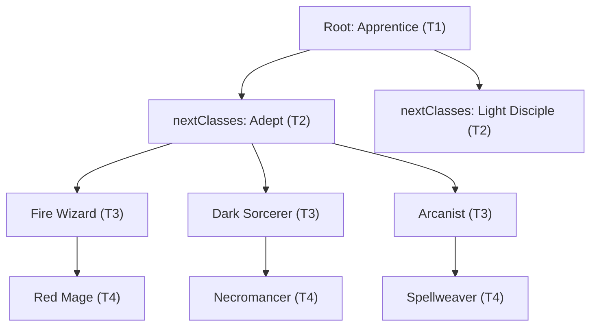

# Implementation Plan: In-Game Adventurer Codex & Class Tree Preview

## 1. Goal Description

Introduce an interactive, in-game **Adventurer Codex** (accessible via the main navigation drawer alongside the **Bestiary**) that allows players to preview all adventurer classes across all 9 tiers (Tier 1 to Tier 9).

For every class, players will be able to inspect:
- **Full Branching Evolution Trees** (e.g., Apprentice $\to$ Adept $\to$ Fire Wizard / Dark Sorcerer / Arcanist $\to$ ... $\to$ Tier 9).
- **Base Stats & Scaling Multipliers** (HP, Mana, Physical Attack, Magic Attack, DEF, MDEF, DEX, Critical, Threat).
- **Active Skills** (exact damage multipliers, area-of-effect targets, mana costs, and status effects).
- **Passive Abilities** (full descriptions and combat trigger mechanics).
- **Promotion Requirements** (level thresholds like Lv 10, 15, 20... and required evolution items/vials).

---

## 2. Technical Performance & Zero-Lag Architecture

### Will it make the game heavier or load slower?
**No. It will have 0% impact on startup time, runtime tick performance, and save file size.**

| Dimension | Impact | Architectural Reason |
| :--- | :--- | :--- |
| **Startup / Load Time** | **0 ms** | The Codex is a lazy-loaded modal dialog (`CustomDialog`). It is never invoked or instantiated during `MainActivity.onCreate()` or while parsing `save.json`. |
| **APK / Storage Size** | **< 30 KB** | Reuses all existing sprites (`R.drawable`), strings, and compiled class bytecode. Only adds two lightweight layout XML files and the tree traversal logic. |
| **Memory / RAM** | **Negligible** | Uses standard Android view recycling (`RecyclerView`). Temporary preview instances are created on-the-fly and immediately eligible for garbage collection. |
| **Save File Size** | **0 bytes** | Read-only archive querying static game code; no extra fields or bloat added to `save.json`. |
| **Maintainability** | **Automatic** | Traverses `Adventurer.nextClasses` dynamically, so **any newly added modded class** (such as the Outlander line or Single-Target Burst Mage) automatically appears in the Codex without hardcoded duplicate registries. |

---

## 3. Data Architecture & Dynamic Tree Discovery

Every adventurer class subclassing `Adventurer` in `it.paranoidsquirrels.idleguildmaster.storage.data.entities.adventurers.units` already declares its promotion destinations in its constructor via `nextClasses.add(...)`.

### 3.1 Root Archetypes
The class trees originate from the base Tier 1 roots:
1. **Footman** (`Footman` $\to$ Warrior, Guard, Knight, Paladin, Dark Knight, Royal Guard, Titan, Divine Duelist, Angel of War, etc.)
2. **Apprentice** (`Apprentice` $\to$ Adept, Light Disciple, Fire Wizard, Dark Sorcerer, Necromancer, Lich, Archangel, Balrog, Arcanist, etc.)
3. **Rogue** (`Rogue` $\to$ Cutthroat, Archer, Assassin, Huntress, Shadow Dancer, Spire Initiate, Marksman, Tempest, Celestial Rain, etc.)
4. **Outlander** (Modded 5th Class Tree $\to$ Marauder, Heathen, Berserker, Beast Tamer, Druid, Exile lines)

### 3.2 Dynamic Tree Traversal
Instead of manually hardcoding hundreds of class pairs, the `AdventurerCodexTreeResolver` traverses the graph starting from the roots:



```kotlin
data class CodexNode(
    val className: String,
    val tier: Int,
    val parentClass: String?,
    val children: List<CodexNode>
)
```

By querying `Adventurer.getInstance(className, -100, 1, 0, null, null, null, null, null, null, null, false)`, the game generates a standard preview instance with clean base stats and full abilities.

---

## 4. UI & UX Design

### 4.1 Navigation Drawer Entry Point
In `res/menu/drawer_nav_menu.xml`, add the Codex entry directly under the **Bestiary**:
```xml
<group android:id="@+id/group_codex" android:checkableBehavior="none">
    <item 
        android:id="@+id/adventurer_codex" 
        android:icon="@drawable/drawer_icon_codex" 
        android:title="@string/drawer_adventurer_codex_title" />
</group>
```

### 4.2 Dialog Window Layout (`dialog_adventurer_codex.xml`)
- **Title Bar**: "ADVENTURER CODEX" with Close `X` button.
- **Archetype Filter Bar**: Horizontal scrollable ChipGroup / Toggle buttons:
  - `[All Classes]`, `[Footman]`, `[Apprentice]`, `[Rogue]`, `[Outlander]`
- **Tier Quick-Jump / Filter**: Optional pills for `[T1]`, `[T2]`, ... `[T9]`.
- **Tree Content Area**:
  - A scrollable `RecyclerView` presenting expandable tree branches or tiered rows.
  - Each item card (`item_codex_adventurer_card.xml`):
    - **Class Avatar**: Framed icon (`adventurer.imageId`).
    - **Class Name**: Localized title (`adventurer.idName`).
    - **Tier & Level Requirement**: e.g., `Tier 4 • Level 20`.
    - **Gear Proficiencies**: Weapon & Armor icons (e.g. Staff / Light Armor).
    - **Evolution Reagent**: Displays required material (e.g., `Evo-22 Vial` or `None`) if applicable.
    - **Branch Indicator**: Arrow connecting to child promotions.

### 4.3 Full Stat & Skill Detail Inspection
Tapping any card in the tree immediately opens the standard, familiar detail view:
```kotlin
UIUtils.getAdventurerDetailDialog(parentFragmentManager, previewAdventurer, false, false)
```
This reuses [`DialogEntityDetail`](file:///c:/Repositories/IGM-Modded/app/src/main/kotlin/it/paranoidsquirrels/idleguildmaster/ui/dialogs/DialogEntityDetail.kt) to show:
- Level 1 base stats & attribute scaling.
- Active skill details with full multiplier text, mana cost, and target mode.
- Passive trait descriptions.
- Full artwork.

---

## 5. Implementation Steps & Work Breakdown

### Phase 1: Resources & Navigation
- [ ] Create vector icon `drawer_icon_codex.xml` (tome/archive motif using existing brass/gold styling).
- [ ] Add strings in `res/values/strings.xml` and `values-*/strings.xml`:
  - `drawer_adventurer_codex_title` ("Adventurer Codex" / "Class Trees")
  - `codex_filter_all` ("All")
  - `codex_filter_footman` ("Footman")
  - `codex_filter_apprentice` ("Apprentice")
  - `codex_filter_rogue` ("Rogue")
  - `codex_filter_outlander` ("Outlander")
  - `codex_tier_label` ("Tier %d (Lv %d)")
  - `codex_tap_to_inspect` ("Tap to inspect stats & skills")
- [ ] Register navigation item in `res/menu/drawer_nav_menu.xml`.
- [ ] Attach listener in `MainActivity.attachListeners()` to launch `DialogAdventurerCodex`.

### Phase 2: Tree Model & Resolver
- [ ] Create `it.paranoidsquirrels.idleguildmaster.storage.data.entities.adventurers.codex.AdventurerCodexTreeResolver.kt`:
  - Define root classes (`Footman`, `Apprentice`, `Rogue`, `Outlander`).
  - Implement recursive `buildTree(rootClassName: String): CodexNode`.
  - Cache the tree in-memory after first build so traversal occurs only once per app session (taking < 2ms).

### Phase 3: Layouts & UI Components
- [ ] Create `app/src/main/res/layout/dialog_adventurer_codex.xml`:
  - Header with title, close button, and category filter chips.
  - `RecyclerView` with smooth vertical scrolling.
- [ ] Create `app/src/main/res/layout/item_codex_adventurer_card.xml`:
  - Brass-bordered card matching vanilla UI aesthetics (`object_border_brass`).
  - Class sprite (`ImageView`), class name (`TextView`), tier badge (`TextView`), and branch connector indicator.
- [ ] Create `CodexAdapter.kt` binding `CodexNode` items to cards.

### Phase 4: Integration with Entity Detail Dialog
- [ ] Add item click listener in `CodexAdapter`:
  - On click, retrieve or instantiate dummy `Adventurer.getInstance(node.className, -100, 1, 0, null, null, null, null, null, null, null, false)`.
  - Call `UIUtils.getAdventurerDetailDialog(parentFragmentManager, previewAdv, false, false)`.

### Phase 5: Testing & Validation
- [ ] Create `app/src/test/kotlin/it/paranoidsquirrels/idleguildmaster/AdventurerCodexTest.kt`:
  - Assert that all 4 base roots resolve without circular dependency loops.
  - Assert that all reachable nodes can be instantiated via `Adventurer.getInstance()` without throwing exceptions.
  - Assert that all tiers up to Tier 9 are represented in the tree.
  - Verify that no static memory leaks occur when closing the dialog.

---

## 6. Verification Checklist & Success Criteria

1. **Accessibility**: Tapping the navigation drawer item opens the Codex smoothly with no frame drops.
2. **Completeness**: Every vanilla class and modded class (e.g. Angel of War, Titan, Divine Duelist, Arcanist line, Outlander line) is visible in its corresponding branch.
3. **Inspectability**: Tapping any node displays complete stats, active skills, and passive tooltips accurately.
4. **Zero Overhead**: Game startup time, memory consumption during exploration/combat, and save file integrity are 100% unaffected.
