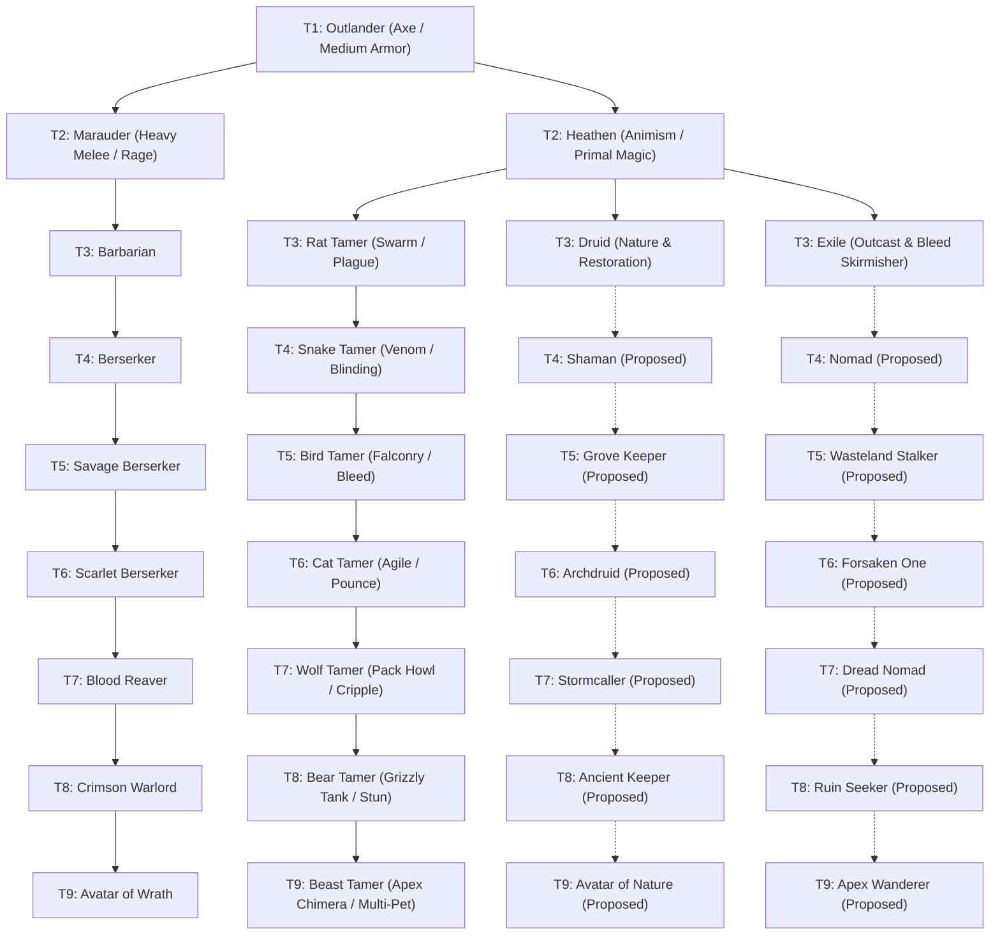

# Implementation Plan: 5th Base Adventurer Class — Outlander

## 1. Goal Description

Introduce **Outlander** as the 5th base adventurer class in *Idle Guild Master*, expanding beyond the original four archetypes (Footman, Rogue, Archer, Apprentice).

The Outlander represents the untamed wilderness: survivalists, ferocious berserkers, animist shamans, and beast tamers. Armed primarily with the newly introduced **Axe** weapon type and clad in **Medium Armor**, the Outlander tree introduces high-variance heavy melee, brutal rage mechanics, and persistent combat animal companions.

---

## 2. Class Tree Architecture & Branching



---

## 3. Core Class Archetypes & Mechanics

### 3.1 Base Class: Outlander (Tier 1)
- **Primary Weapon**: [Axe](file:///c:/Repositories/IGM-Modded/plans/planned/crafting/axe-weapon-type.md) (`R.string.type_axe`). High CON scaling, $\pm 20\%$ attack spread.
- **Armor Type**: Medium Armor (`R.string.type_armor_medium`).
- **Potion Profile**: `WARRIOR` (Constitution & Physical bulk emphasis).
- **Recruitment**: Added to Tavern pool via [`Utils.rollClass()`](file:///c:/Repositories/IGM-Modded/app/src/main/kotlin/it/paranoidsquirrels/idleguildmaster/Utils.kt#L179-L187) with equal 20% distribution across Footman, Rogue, Archer, Apprentice, and Outlander.
- **Level Cap**: 5.
- **Promotion Choices**:
  - `nextClasses.add("Marauder")` (Physical fury & heavy combat path)
  - `nextClasses.add("Heathen")` (Primal wild & companion path)

---

### 3.2 Branch 1: The Marauder / Berserker Progression
Focuses on escalating rage, critical strikes, lifesteal, and extra attacks at low HP thresholds.

#### Berserker Rebalance Note:
> [!NOTE]
> Currently, [`Berserker.kt`](file:///c:/Repositories/IGM-Modded/app/src/main/kotlin/it/paranoidsquirrels/idleguildmaster/storage/data/entities/adventurers/units/Berserker.kt) exists as a standalone T9 hero (`maxLevel = 45`). Under this plan, it is re-slotted as the canonical **Tier 4** anchor of the Marauder tree (`maxLevel = 20`), matching the game's tier structure, while T5 through T9 extend its fury into godlike wrath.

| Tier | Class Name | Max Lv | HP | CON | DEX | Active Skill | Passive Skill | Special Mechanics |
| :--- | :--- | :--- | :--- | :--- | :--- | :--- | :--- | :--- |
| **T1** | `Outlander` | 5 | 42 | 9 | 5 | `ACTIVE_MIGHTY_STRIKE` | `PASSIVE_NONE` | Base axe physical melee |
| **T2** | `Marauder` | 10 | 70 | 14 | 7 | `ACTIVE_CRUSHING_STRIKE` | `PASSIVE_THREATENING_I` | +5% Crit Chance |
| **T3** | `Barbarian` | 15 | 105 | 20 | 9 | `ACTIVE_OVERWHELM` | `PASSIVE_RETALIATE` | 10% Lifesteal |
| **T4** | `Berserker` | 20 | 150 | 28 | 12 | `ACTIVE_DECIMATE_I` | `PASSIVE_BERSERKER_RAGE` | Extra attack if HP $< 50\%$, 15% Lifesteal |
| **T5** | `SavageBerserker` | 25 | 205 | 37 | 15 | `ACTIVE_DECIMATE_II` | `PASSIVE_BERSERKER_RAGE` | Extra attack if HP $< 50\%$, 20% Lifesteal, +10% Crit Dmg |
| **T6** | `ScarletBerserker` | 30 | 270 | 48 | 18 | `ACTIVE_DECIMATE_III` | `PASSIVE_BLIND_RAGE` | 2x Extra attack if HP $< 40\%$, 25% Lifesteal, Bleed application |
| **T7** | `BloodReaver` | 35 | 345 | 60 | 22 | `ACTIVE_WHIP_AND_TEAR` | `PASSIVE_TRUE_LIFESTEAL` | 30% Lifesteal, heals through shields |
| **T8** | `CrimsonWarlord` | 40 | 430 | 74 | 26 | `ACTIVE_ANNIHILATE` | `PASSIVE_BERSERKER_RAGE` | 2x Extra attack if HP $< 50\%$, +30% Party Attack buff |
| **T9** | `AvatarOfWrath` | 45 | 530 | 90 | 32 | `ACTIVE_OBLITERATE` | `PASSIVE_BERSERKER_RAGE` | 3x Extra attacks if HP $< 50\%$, 40% Lifesteal, ignores armor |

---

### 3.3 Branch 2: The Heathen / Beast Tamer Progression
Focuses on fighting alongside dedicated animal companions. Leverages the existing [`minionBound`](file:///c:/Repositories/IGM-Modded/app/src/main/kotlin/it/paranoidsquirrels/idleguildmaster/storage/data/entities/adventurers/Adventurer.kt#L99) and [`summonedMinion = true`](file:///c:/Repositories/IGM-Modded/app/src/main/kotlin/it/paranoidsquirrels/idleguildmaster/storage/data/entities/adventurers/units/Skeleton.kt#L26) engine architecture.

#### Animal Companion Mechanics:
- When a Beast Tamer enters combat in [`Area.kt`](file:///c:/Repositories/IGM-Modded/app/src/main/kotlin/it/paranoidsquirrels/idleguildmaster/storage/data/places/Area.kt), their bound animal companion is automatically deployed directly into the adventuring party line if party size permits.
- If the animal companion falls, the Tamer gains a temporary Enrage buff.
- The Tamer's own skills heal or command their companion.

| Tier | Tamer Class | Max Lv | Companion Unit | Companion Specialty | Companion Attack / Skill |
| :--- | :--- | :--- | :--- | :--- | :--- |
| **T2** | `Heathen` | 10 | (None / Spirit) | Animist rites | `ACTIVE_HEAL`, +5 DEF/MDEF |
| **T3** | `RatTamer` | 15 | `SummonedRat` | Swarm tactics | Fast poison bite, high dodge |
| **T4** | `SnakeTamer` | 20 | `SummonedSnake` | Neurotoxic venom | Blinding venom spit, paralysis chance |
| **T5** | `BirdTamer` | 25 | `SummonedFalcon` | Aerial reconnaissance | Piercing talon dive, 100% crit chance on bleeding targets |
| **T6** | `CatTamer` | 30 | `SummonedPanther` | Ambush predator | Stealth pounce, high agility, disembowel |
| **T7** | `WolfTamer` | 35 | `SummonedDireWolf`| Pack leader | Alpha howl (+20% party crit), crippling hamstring bite |
| **T8** | `BearTamer` | 40 | `SummonedGrizzly` | Heavy frontline tank | Massive HP/DEF, taunting roar, mauling swipe stun |
| **T9** | `BeastTamer` | 45 | `SummonedBeastSovereign` | Mythic apex predator | Cleaving bite, AoE roar, regenerates HP each turn |

---

### 3.4 Branch 3: The Druid Progression (Proposed)
Focuses on Primal Nature magic, healing, terrain blessings, and storm elements.
- **T1**: `Outlander`
- **T2**: `Heathen`
- **T3**: `Druid` (Max Lv 15) — Nature restoration (`ACTIVE_RESTORATION_I`), +Regeneration passive.
- **T4**: `Shaman` (Max Lv 20) — Elemental totems, cleanse, lightning burst.
- **T5**: `GroveKeeper` (Max Lv 25) — Nature thorns protection, party HP regen.
- **T6**: `Archdruid` (Max Lv 30) — `ACTIVE_SOOTHING_WINDS`, high magic defense.
- **T7**: `Stormcaller` (Max Lv 35) — Tempest lightning AoE, tempest shield.
- **T8**: `AncientKeeper` (Max Lv 40) — Ironbark skin, massive party damage reduction.
- **T9**: `AvatarOfNature` (Max Lv 45) — Revitalizing aura, cataclysmic hurricane burst, true nature immortality.

---

### 3.5 Branch 4: The Exile Progression (Proposed)
Focuses on solitary survival, bleeding guerilla tactics, high evasion, and ruthless execution.
- **T1**: `Outlander`
- **T2**: `Heathen`
- **T3**: `Exile` (Max Lv 15) — Bleed strikes, evasive dodge (`PASSIVE_ELUSIVE`).
- **T4**: `Nomad` (Max Lv 20) — Desert survivor, increased accuracy, sand pocket blind.
- **T5**: `WastelandStalker` (Max Lv 25) — Crippling slice, shadow step.
- **T6**: `ForsakenOne` (Max Lv 30) — Bloodied resolve, damage increases as allies take damage.
- **T7**: `DreadNomad` (Max Lv 35) — Multi-bleed rending, executioner passive.
- **T8**: `RuinSeeker` (Max Lv 40) — Critical strike damage amplified by 50% against debuffed targets.
- **T9**: `ApexWanderer` (Max Lv 45) — Extreme evasion, triple strike assassinations, solitary defiance.

---

## 4. Architectural Modifications & Integrations

### 4.1 Tavern Recruitment Distribution
Modify [`Utils.kt`](file:///c:/Repositories/IGM-Modded/app/src/main/kotlin/it/paranoidsquirrels/idleguildmaster/Utils.kt#L179-L187):
```kotlin
private fun rollClass(): String {
    val dRandom = random()
    return when {
        dRandom < 0.20 -> "Footman"
        dRandom < 0.40 -> "Rogue"
        dRandom < 0.60 -> "Archer"
        dRandom < 0.80 -> "Apprentice"
        else -> "Outlander"
    }
}
```

### 4.2 Class Reflection Registry
Classes will reside in package:
`it.paranoidsquirrels.idleguildmaster.storage.data.entities.adventurers.units`
Because [`Adventurer.getInstance()`](file:///c:/Repositories/IGM-Modded/app/src/main/kotlin/it/paranoidsquirrels/idleguildmaster/storage/data/entities/adventurers/Adventurer.kt#L46) resolves via `Class.forName("...units." + className)`, all new class classes are instantly discoverable without manual registry boilerplate.

### 4.3 Potion Drinker Profile
Add or configure potion drinking scaling in [`PotionDrinkerType.kt`](file:///c:/Repositories/IGM-Modded/app/src/main/kotlin/it/paranoidsquirrels/idleguildmaster/storage/data/entities/adventurers/PotionDrinkerType.kt):
```kotlin
OUTLANDER(10.0, 5.0, 1.0, 11.0, 4.0, 3.0, 3.0, 4.0, 2.0, 10.0, 4.0)
```
Or utilize `PotionDrinkerType.WARRIOR` for pure physical branches and `PotionDrinkerType.THIEF`/`MAGE` for Exile/Druid.

### 4.4 Animal Companion Summoning Integration
In [`Area.kt`](file:///c:/Repositories/IGM-Modded/app/src/main/kotlin/it/paranoidsquirrels/idleguildmaster/storage/data/places/Area.kt), in `startCombat()` / `checkSummonMinion()`:
- Check if any exploring adventurer has a companion skill or beast tamer class.
- Instantiate companion with `summonedMinion = true` and bind to `adventurer.minionBound`.
- Companion attacks alongside party during turn order.

---

## 5. User Decisions & Feedback Needed

> [!IMPORTANT]
> 1. **Druid & Exile T4–T9 Progression**:
>    Do you approve the proposed progression names for Druid (`Shaman` $\to$ `GroveKeeper` $\to$ `Archdruid` $\to$ `Stormcaller` $\to$ `AncientKeeper` $\to$ `AvatarOfNature`) and Exile (`Nomad` $\to$ `WastelandStalker` $\to$ `ForsakenOne` $\to$ `DreadNomad` $\to$ `RuinSeeker` $\to$ `ApexWanderer`), or would you prefer alternative themes?
> 2. **Berserker Slotting**:
>    Confirm refactoring existing T9 Berserker to T4 (maxLevel 20) with stats scaled appropriately, while Savage Berserker through Avatar of Wrath form T5–T9.
> 3. **Beast Companion Mechanics**:
>    Confirm that companions fight as summoned units occupying combat slots (similar to Necromancer skeleton summons), or should they act as end-of-turn extra attacks (similar to Wyrm Rider mounts)?

---

## 6. Verification & Implementation Checklist

- [ ] Add `Outlander.kt` base adventurer class.
- [ ] Update `Utils.rollClass()` to 20% 5-class distribution.
- [ ] Implement Marauder line: `Marauder.kt`, `Barbarian.kt`, refactored `Berserker.kt`, `SavageBerserker.kt`, `ScarletBerserker.kt`, `BloodReaver.kt`, `CrimsonWarlord.kt`, `AvatarOfWrath.kt`.
- [ ] Implement Heathen & Beast Tamer line: `Heathen.kt`, `RatTamer.kt`, `SnakeTamer.kt`, `BirdTamer.kt`, `CatTamer.kt`, `WolfTamer.kt`, `BearTamer.kt`, `BeastTamer.kt`.
- [ ] Implement companion summoned units: `SummonedRat.kt`, `SummonedSnake.kt`, `SummonedFalcon.kt`, `SummonedPanther.kt`, `SummonedDireWolf.kt`, `SummonedGrizzly.kt`, `SummonedBeastSovereign.kt`.
- [ ] Implement Druid and Exile lines upon user confirmation of T4–T9 naming.
- [ ] Add string resources for all class names and descriptions to `strings.xml`.
- [ ] Verify test suite passes (`./gradlew testDebugUnitTest`).
