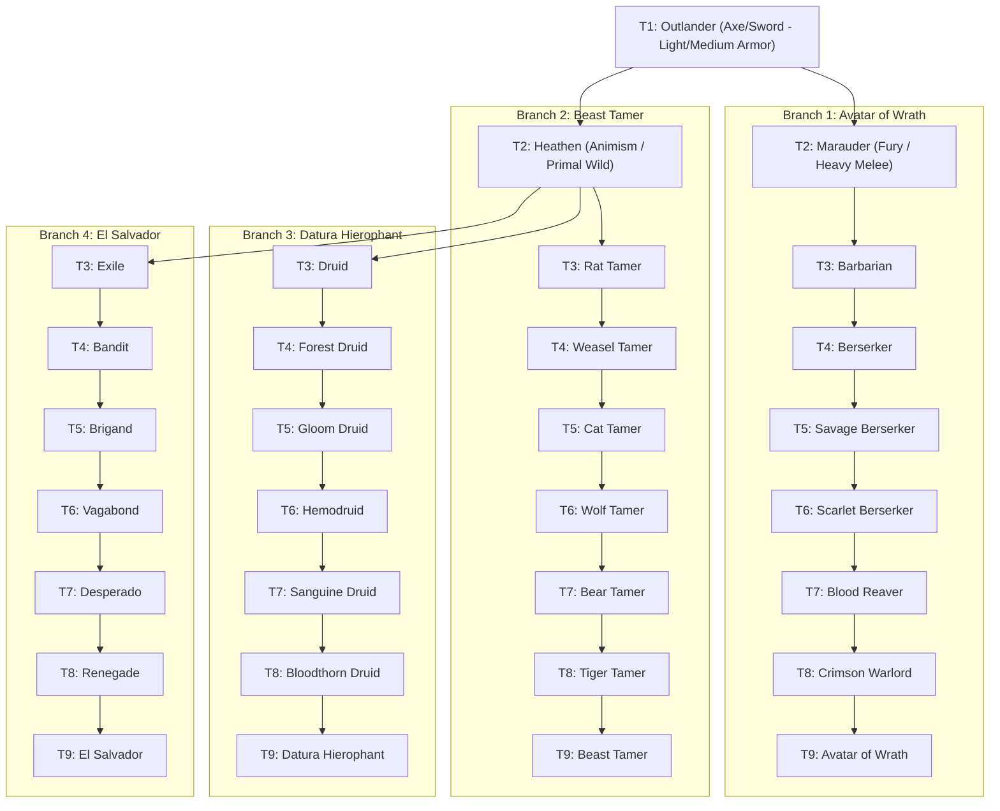

# Implementation Plan: 5th Base Adventurer Class — Outlander (All 4 Paths)

## 1. Goal Description

Introduce **Outlander** as the 5th base adventurer class in *Idle Guild Master*, expanding beyond the original four archetypes (Footman, Rogue, Archer, Apprentice).

The Outlander represents the untamed wilderness: survivalists, ferocious berserkers, animist beast tamers, sanguine druids, and elusive outlaws. Armed with the **Axe** and **Sword** weapon types and utilizing **Light** and **Medium Armor**, the Outlander class tree introduces four full 9-tier evolutionary paths:
1. **Avatar of Wrath**: Heavy melee, escalating rage, lifesteal, consecutive strikes, and reset-on-kill slaughter mechanics.
2. **Beast Tamer**: Animism and combat animal companions, deploying persistent summons (Rats, Weasel, Cat, Wolf, Bear, Tiger, Owlbear) directly into combat.
3. **Datura Hierophant**: Primeval nature and sanguine rituals, utilizing staves and entangling thorns to debilitate foes and extract life essence.
4. **El Salvador**: Frontier outlaws and solitary skirmishers, relying on extreme evasion, counter-momentum, and lethal flurry assassinations.

---

## 2. Complete Class Tree Architecture & Branching

```mermaid
graph TD
    T1["T1: Outlander (Axe/Sword - Light/Medium Armor)"]
    
    %% Base branches into 2 Tier 2 roots
    T1 --> T2M["T2: Marauder (Fury / Heavy Melee)"]
    T1 --> T2H["T2: Heathen (Animism / Primal Wild)"]
    
    %% Branch 1: Avatar of Wrath
    subgraph "Branch 1: Avatar of Wrath"
        T2M --> T3B["T3: Barbarian"]
        T3B --> T4B["T4: Berserker"]
        T4B --> T5SB["T5: Savage Berserker"]
        T5SB --> T6SB["T6: Scarlet Berserker"]
        T6SB --> T7BR["T7: Blood Reaver"]
        T7BR --> T8CW["T8: Crimson Warlord"]
        T8CW --> T9AW["T9: Avatar of Wrath"]
    end
    
    %% Branch 2: Beast Tamer & Summons
    subgraph "Branch 2: Beast Tamer"
        T2H --> T3RT["T3: Rat Tamer"]
        T3RT --> T4WT["T4: Weasel Tamer"]
        T4WT --> T5CT["T5: Cat Tamer"]
        T5CT --> T6WFT["T6: Wolf Tamer"]
        T6WFT --> T7BRT["T7: Bear Tamer"]
        T7BRT --> T8TT["T8: Tiger Tamer"]
        T8TT --> T9BT["T9: Beast Tamer"]
    end
    
    %% Branch 3: Datura Hierophant
    subgraph "Branch 3: Datura Hierophant"
        T2H --> T3D["T3: Druid"]
        T3D --> T4FD["T4: Forest Druid"]
        T4FD --> T5GD["T5: Gloom Druid"]
        T5GD --> T6HD["T6: Hemodruid"]
        T6HD --> T7SD["T7: Sanguine Druid"]
        T7SD --> T8BD["T8: Bloodthorn Druid"]
        T8BD --> T9DH["T9: Datura Hierophant"]
    end
    
    %% Branch 4: El Salvador
    subgraph "Branch 4: El Salvador"
        T2H --> T3E["T3: Exile"]
        T3E --> T4BN["T4: Bandit"]
        T4BN --> T5BG["T5: Brigand"]
        T5BG --> T6VG["T6: Vagabond"]
        T6VG --> T7DP["T7: Desperado"]
        T7DP --> T8RN["T8: Renegade"]
        T8RN --> T9ES["T9: El Salvador"]
    end
```

---

## 3. Detailed Specifications by Branch

### 3.1 Base Class: Outlander (Tier 1)
- **Class File**: [`Outlander.kt`](file:///c:/Repositories/IGM-Modded/app/src/main/kotlin/it/paranoidsquirrels/idleguildmaster/storage/data/entities/adventurers/units/Outlander.kt)
- **Sprite**: `@drawable/unit_outlander`
- **Max Level**: 5 | **HP**: 42 | **CON**: 9 | **INT**: 4 | **DEX**: 5 | **DEF**: 10 | **MDEF**: 10
- **Equipment**: Sword / Axe, Light Armor
- **Potion Drinker Profile**: `PotionDrinkerType.WARRIOR`
- **Promotions**: `Marauder` (Physical Melee), `Heathen` (Primal Wild)

---

### 3.2 Branch 1: Avatar of Wrath (Heavy Melee / Berserker Rage)
Focuses on escalating attack frequency, critical hits, lifesteal, and self-buffing `RAGE` when falling below HP thresholds.

| Tier | Class Name | File | Sprite | Max Lv | HP | CON | INT | DEX | DEF | MDEF | Planned Active | Planned Passive | Specialty |
| :--- | :--- | :--- | :--- | :--- | :--- | :--- | :--- | :--- | :--- | :--- | :--- | :--- | :--- |
| **T2** | `Marauder` | [`Marauder.kt`](file:///c:/Repositories/IGM-Modded/app/src/main/kotlin/it/paranoidsquirrels/idleguildmaster/storage/data/entities/adventurers/units/Marauder.kt) | `@drawable/unit_marauder` | 10 | 60 | 14 | 6 | 3 | 10 | 10 | `ACTIVE_WILD_STRIKES` | `PASSIVE_RAGE` | Extra attack if HP $\le 50\%$ |
| **T3** | `Barbarian` | [`Barbarian.kt`](file:///c:/Repositories/IGM-Modded/app/src/main/kotlin/it/paranoidsquirrels/idleguildmaster/storage/data/entities/adventurers/units/Barbarian.kt) | `@drawable/unit_barbarian` | 15 | 85 | 15 | 9 | 3 | 10 | 10 | `ACTIVE_BRUTAL_STRIKES` | `PASSIVE_RAGE` | Consecutive strike chances |
| **T4** | `Berserker` | [`Berserker.kt`](file:///c:/Repositories/IGM-Modded/app/src/main/kotlin/it/paranoidsquirrels/idleguildmaster/storage/data/entities/adventurers/units/Berserker.kt) | `@drawable/unit_berserker_hero` | 20 | 125 | 17 | 10 | 3 | 10 | 10 | `ACTIVE_BRUTAL_STRIKES` | `PASSIVE_BERSERKERR_RAGE` | Gains `RAGE` when HP $< 50\%$ |
| **T5** | `SavageBerserker` | [`SavageBerserker.kt`](file:///c:/Repositories/IGM-Modded/app/src/main/kotlin/it/paranoidsquirrels/idleguildmaster/storage/data/entities/adventurers/units/SavageBerserker.kt) | `@drawable/unit_savage_berserker` | 25 | 170 | 25 | 13 | 4 | 10 | 10 | `ACTIVE_BRUTAL_STRIKES` | `PASSIVE_SAVAGE_RAGE` | +25% Lifesteal, self-Rage |
| **T6** | `ScarletBerserker` | [`ScarletBerserker.kt`](file:///c:/Repositories/IGM-Modded/app/src/main/kotlin/it/paranoidsquirrels/idleguildmaster/storage/data/entities/adventurers/units/ScarletBerserker.kt) | `@drawable/unit_scarlet_berserker` | 30 | 200 | 27 | 15 | 4 | 10 | 10 | `ACTIVE_BRUTAL_STRIKES_II` | `PASSIVE_SAVAGE_RAGE` | 1.1x CON scaling, +25% Lifesteal |
| **T7** | `BloodReaver` | [`BloodReaver.kt`](file:///c:/Repositories/IGM-Modded/app/src/main/kotlin/it/paranoidsquirrels/idleguildmaster/storage/data/entities/adventurers/units/BloodReaver.kt) | `@drawable/unit_blood_reaver` | 35 | 230 | 31 | 18 | 5 | 15 | 15 | `ACTIVE_BLOODY_SLAUGHTER` | `PASSIVE_SAVAGE_RAGE` | Recasts active skill on kill |
| **T8** | `CrimsonWarlord` | [`CrimsonWarlord.kt`](file:///c:/Repositories/IGM-Modded/app/src/main/kotlin/it/paranoidsquirrels/idleguildmaster/storage/data/entities/adventurers/units/CrimsonWarlord.kt) | `@drawable/unit_crimson_warlord` | 40 | 270 | 37 | 21 | 6 | 20 | 20 | `ACTIVE_BLOODY_SLAUGHTER` | `PASSIVE_SAVAGE_RAGE_II` | Rage triggers at $< 75\%$ HP |
| **T9** | `AvatarOfWrath` | [`AvatarOfWrath.kt`](file:///c:/Repositories/IGM-Modded/app/src/main/kotlin/it/paranoidsquirrels/idleguildmaster/storage/data/entities/adventurers/units/AvatarOfWrath.kt) | `@drawable/unit_avatar_of_wrath` | 45 | 320 | 44 | 25 | 7 | 25 | 25 | `ACTIVE_BLESSING_OF_SLAUGHTER` | `PASSIVE_SAVAGE_RAGE_II` | Grants party Rage, recasts on kill |

---

### 3.3 Branch 2: Beast Tamer & Companion Summons
Focuses on animal mastery. Tamers summon and command combat pets that occupy fighting group slots and attack alongside the party.

#### Tamers Progression (T2–T9):
| Tier | Class Name | File | Sprite | Max Lv | HP | CON | INT | DEX | DEF | MDEF | Planned Companion |
| :--- | :--- | :--- | :--- | :--- | :--- | :--- | :--- | :--- | :--- | :--- | :--- |
| **T2** | `Heathen` | [`Heathen.kt`](file:///c:/Repositories/IGM-Modded/app/src/main/kotlin/it/paranoidsquirrels/idleguildmaster/storage/data/entities/adventurers/units/Heathen.kt) | `@drawable/unit_heathen` | 10 | 50 | 11 | 9 | 3 | 10 | 10 | (Primal root - branches into 3 paths) |
| **T3** | `RatTamer` | [`RatTamer.kt`](file:///c:/Repositories/IGM-Modded/app/src/main/kotlin/it/paranoidsquirrels/idleguildmaster/storage/data/entities/adventurers/units/RatTamer.kt) | `@drawable/unit_rat_tamer` | 15 | 70 | 13 | 12 | 5 | 10 | 10 | `Rat` (85%) / `AlbinoRat` (15%) |
| **T4** | `WeaselTamer` | [`WeaselTamer.kt`](file:///c:/Repositories/IGM-Modded/app/src/main/kotlin/it/paranoidsquirrels/idleguildmaster/storage/data/entities/adventurers/units/WeaselTamer.kt) | `@drawable/unit_weasel_tamer` | 20 | 100 | 16 | 15 | 7 | 10 | 10 | `SummonWeasel` |
| **T5** | `CatTamer` | [`CatTamer.kt`](file:///c:/Repositories/IGM-Modded/app/src/main/kotlin/it/paranoidsquirrels/idleguildmaster/storage/data/entities/adventurers/units/CatTamer.kt) | `@drawable/unit_cat_tamer` | 25 | 140 | 20 | 18 | 10 | 12 | 12 | `SummonCat` |
| **T6** | `WolfTamer` | [`WolfTamer.kt`](file:///c:/Repositories/IGM-Modded/app/src/main/kotlin/it/paranoidsquirrels/idleguildmaster/storage/data/entities/adventurers/units/WolfTamer.kt) | `@drawable/unit_wolf_tamer` | 30 | 180 | 24 | 22 | 13 | 15 | 15 | `SummonWolf` |
| **T7** | `BearTamer` | [`BearTamer.kt`](file:///c:/Repositories/IGM-Modded/app/src/main/kotlin/it/paranoidsquirrels/idleguildmaster/storage/data/entities/adventurers/units/BearTamer.kt) | `@drawable/unit_bear_tamer` | 35 | 230 | 29 | 26 | 16 | 18 | 18 | `SummonBear` |
| **T8** | `TigerTamer` | [`TigerTamer.kt`](file:///c:/Repositories/IGM-Modded/app/src/main/kotlin/it/paranoidsquirrels/idleguildmaster/storage/data/entities/adventurers/units/TigerTamer.kt) | `@drawable/unit_tiger_tamer` | 40 | 280 | 34 | 30 | 19 | 20 | 20 | `SummonTiger` |
| **T9** | `BeastTamer` | [`BeastTamer.kt`](file:///c:/Repositories/IGM-Modded/app/src/main/kotlin/it/paranoidsquirrels/idleguildmaster/storage/data/entities/adventurers/units/BeastTamer.kt) | `@drawable/unit_beast_tamer` | 45 | 340 | 40 | 35 | 22 | 25 | 25 | `SummonOwlbear` |

#### Summon Companion Units:
| Companion | Class File | Sprite | Max Lv | HP | CON | INT | DEX | DEF | MDEF | Weapon |
| :--- | :--- | :--- | :--- | :--- | :--- | :--- | :--- | :--- | :--- | :--- |
| `Rat` | [`Rat.kt`](file:///c:/Repositories/IGM-Modded/app/src/main/kotlin/it/paranoidsquirrels/idleguildmaster/storage/data/entities/adventurers/units/Rat.kt) | `@drawable/unit_rat` | 15 | 10 | 5 | 5 | 5 | 0 | 0 | `RatClaws` |
| `AlbinoRat` | [`AlbinoRat.kt`](file:///c:/Repositories/IGM-Modded/app/src/main/kotlin/it/paranoidsquirrels/idleguildmaster/storage/data/entities/adventurers/units/AlbinoRat.kt) | `@drawable/unit_albino_rat` | 15 | 15 | 6 | 6 | 6 | 1 | 1 | `RatClaws` |
| `SummonWeasel` | [`SummonWeasel.kt`](file:///c:/Repositories/IGM-Modded/app/src/main/kotlin/it/paranoidsquirrels/idleguildmaster/storage/data/entities/adventurers/units/SummonWeasel.kt) | `@drawable/unit_summon_weasel` | 20 | 25 | 8 | 6 | 10 | 2 | 2 | Innate / Claws |
| `SummonCat` | [`SummonCat.kt`](file:///c:/Repositories/IGM-Modded/app/src/main/kotlin/it/paranoidsquirrels/idleguildmaster/storage/data/entities/adventurers/units/SummonCat.kt) | `@drawable/unit_summon_cat` | 25 | 40 | 10 | 7 | 15 | 4 | 4 | Innate / Claws |
| `SummonWolf` | [`SummonWolf.kt`](file:///c:/Repositories/IGM-Modded/app/src/main/kotlin/it/paranoidsquirrels/idleguildmaster/storage/data/entities/adventurers/units/SummonWolf.kt) | `@drawable/unit_summon_wolf` | 30 | 60 | 14 | 8 | 18 | 6 | 6 | Innate / Claws |
| `SummonBear` | [`SummonBear.kt`](file:///c:/Repositories/IGM-Modded/app/src/main/kotlin/it/paranoidsquirrels/idleguildmaster/storage/data/entities/adventurers/units/SummonBear.kt) | `@drawable/unit_summon_bear` | 35 | 100 | 20 | 9 | 12 | 12 | 10 | Innate / Claws |
| `SummonTiger` | [`SummonTiger.kt`](file:///c:/Repositories/IGM-Modded/app/src/main/kotlin/it/paranoidsquirrels/idleguildmaster/storage/data/entities/adventurers/units/SummonTiger.kt) | `@drawable/unit_summon_tiger` | 40 | 130 | 24 | 10 | 24 | 14 | 12 | Innate / Claws |
| `SummonOwlbear` | [`SummonOwlbear.kt`](file:///c:/Repositories/IGM-Modded/app/src/main/kotlin/it/paranoidsquirrels/idleguildmaster/storage/data/entities/adventurers/units/SummonOwlbear.kt) | `@drawable/unit_summon_owlbear` | 45 | 180 | 30 | 12 | 20 | 18 | 15 | Innate / Claws |

- **Companion Weapon**: [`RatClaws.kt`](file:///c:/Repositories/IGM-Modded/app/src/main/kotlin/it/paranoidsquirrels/idleguildmaster/storage/data/items/instances/RatClaws.kt) (`@drawable/rat_claws`), 0g price, +1 CON, +1 DEX, +5% Crit.

---

### 3.4 Branch 3: Datura Hierophant (Nature Magic / Sanguine Druids)
Equipped with **Staves** and **Light Armor**, scaling with high Intelligence and Constitution. Specializes in immobilizing targets with `ENTANGLE` and harvesting life essence through bleeding brambles and virulent rot.

| Tier | Class Name | File | Sprite | Max Lv | HP | CON | INT | DEX | DEF | MDEF | Planned Role |
| :--- | :--- | :--- | :--- | :--- | :--- | :--- | :--- | :--- | :--- | :--- | :--- |
| **T3** | `Druid` | [`Druid.kt`](file:///c:/Repositories/IGM-Modded/app/src/main/kotlin/it/paranoidsquirrels/idleguildmaster/storage/data/entities/adventurers/units/Druid.kt) | `@drawable/unit_druid` | 15 | 65 | 14 | 14 | 4 | 10 | 10 | Nature vines, 75% Entangle on hit |
| **T4** | `ForestDruid` | [`ForestDruid.kt`](file:///c:/Repositories/IGM-Modded/app/src/main/kotlin/it/paranoidsquirrels/idleguildmaster/storage/data/entities/adventurers/units/ForestDruid.kt) | `@drawable/unit_forest_druid` | 20 | 95 | 17 | 18 | 6 | 10 | 12 | Canopy warding, group health regen |
| **T5** | `GloomDruid` | [`GloomDruid.kt`](file:///c:/Repositories/IGM-Modded/app/src/main/kotlin/it/paranoidsquirrels/idleguildmaster/storage/data/entities/adventurers/units/GloomDruid.kt) | `@drawable/unit_gloom_druid` | 25 | 130 | 20 | 23 | 8 | 12 | 15 | Fungal rot, darkness debuffs |
| **T6** | `Hemodruid` | [`Hemodruid.kt`](file:///c:/Repositories/IGM-Modded/app/src/main/kotlin/it/paranoidsquirrels/idleguildmaster/storage/data/entities/adventurers/units/Hemodruid.kt) | `@drawable/unit_hemodruid` | 30 | 170 | 24 | 28 | 10 | 14 | 18 | Sanguine sacrifices, burst healing |
| **T7** | `SanguineDruid` | [`SanguineDruid.kt`](file:///c:/Repositories/IGM-Modded/app/src/main/kotlin/it/paranoidsquirrels/idleguildmaster/storage/data/entities/adventurers/units/SanguineDruid.kt) | `@drawable/unit_sanguine_druid` | 35 | 215 | 28 | 34 | 12 | 16 | 22 | Crimson grove, party lifesteal link |
| **T8** | `BloodthornDruid`| [`BloodthornDruid.kt`](file:///c:/Repositories/IGM-Modded/app/src/main/kotlin/it/paranoidsquirrels/idleguildmaster/storage/data/entities/adventurers/units/BloodthornDruid.kt) | `@drawable/unit_bloodthorn_druid` | 40 | 265 | 32 | 40 | 14 | 18 | 26 | Piercing thorns, bleed reflection |
| **T9** | `DaturaHierophant`| [`DaturaHierophant.kt`](file:///c:/Repositories/IGM-Modded/app/src/main/kotlin/it/paranoidsquirrels/idleguildmaster/storage/data/entities/adventurers/units/DaturaHierophant.kt) | `@drawable/unit_datura_hierophant` | 45 | 320 | 36 | 48 | 16 | 20 | 30 | Virulent hallucination & cataclysmic rot |

---

### 3.5 Branch 4: El Salvador (Exiles / Bandits / Frontier Skirmishers)
Equipped with **Swords / Daggers** and **Light Armor**, scaling primarily with Dexterity and Constitution (`PotionDrinkerType.THIEF`). Features extreme agility, evasion buffs, counterattacks, and critical multi-strikes.

| Tier | Class Name | File | Sprite | Max Lv | HP | CON | INT | DEX | DEF | MDEF | Planned Role |
| :--- | :--- | :--- | :--- | :--- | :--- | :--- | :--- | :--- | :--- | :--- | :--- |
| **T3** | `Exile` | [`Exile.kt`](file:///c:/Repositories/IGM-Modded/app/src/main/kotlin/it/paranoidsquirrels/idleguildmaster/storage/data/entities/adventurers/units/Exile.kt) | `@drawable/unit_exile` | 15 | 65 | 12 | 6 | 12 | 8 | 8 | 15% chance to gain `EVASION` (+25% dodge) |
| **T4** | `Bandit` | [`Bandit.kt`](file:///c:/Repositories/IGM-Modded/app/src/main/kotlin/it/paranoidsquirrels/idleguildmaster/storage/data/entities/adventurers/units/Bandit.kt) | `@drawable/unit_bandit` | 20 | 95 | 14 | 8 | 16 | 10 | 10 | Ambush strikes, extra loot find |
| **T5** | `Brigand` | [`Brigand.kt`](file:///c:/Repositories/IGM-Modded/app/src/main/kotlin/it/paranoidsquirrels/idleguildmaster/storage/data/entities/adventurers/units/Brigand.kt) | `@drawable/unit_brigand` | 25 | 130 | 17 | 10 | 21 | 12 | 12 | Rend strikes, crippling bleed |
| **T6** | `Vagabond` | [`Vagabond.kt`](file:///c:/Repositories/IGM-Modded/app/src/main/kotlin/it/paranoidsquirrels/idleguildmaster/storage/data/entities/adventurers/units/Vagabond.kt) | `@drawable/unit_vagabond` | 30 | 170 | 20 | 12 | 27 | 14 | 14 | Elusive shadow step, dodge counter |
| **T7** | `Desperado` | [`Desperado.kt`](file:///c:/Repositories/IGM-Modded/app/src/main/kotlin/it/paranoidsquirrels/idleguildmaster/storage/data/entities/adventurers/units/Desperado.kt) | `@drawable/unit_desperado` | 35 | 215 | 23 | 14 | 33 | 16 | 16 | Reckless flurry attacks |
| **T8** | `Renegade` | [`Renegade.kt`](file:///c:/Repositories/IGM-Modded/app/src/main/kotlin/it/paranoidsquirrels/idleguildmaster/storage/data/entities/adventurers/units/Renegade.kt) | `@drawable/unit_renegade` | 40 | 265 | 26 | 16 | 40 | 18 | 18 | Momentum turnabout, counter damage |
| **T9** | `ElSalvador` | [`ElSalvador.kt`](file:///c:/Repositories/IGM-Modded/app/src/main/kotlin/it/paranoidsquirrels/idleguildmaster/storage/data/entities/adventurers/units/ElSalvador.kt) | `@drawable/unit_el_salvador_1` | 45 | 320 | 30 | 18 | 48 | 20 | 20 | Sovereign retribution, untouchable evasion |

---

## 4. Status Effects & Combat Mechanics

### 4.1 New Status Effects (to be added to `StatusEffectType.kt` and `Area.kt`)
1. **`RAGE`** (`@drawable/effect_rage`):
   - Outgoing damage dealt: $+30\%$ ($\times 1.30$).
   - Incoming damage taken: $+30\%$ ($\times 1.30$).
   - Applied by Berserker passives when HP falls below thresholds.
2. **`ENTANGLE`** (`@drawable/effect_entangle`):
   - Dodge disabled: target cannot dodge attacks (flat $0\%$ dodge).
   - Outgoing damage reduced by $20\%$ ($\times 0.80$).
   - Deals $2\%$ max HP damage at each combat round.
3. **`EVASION`** (`@drawable/effect_evasion`):
   - Grants flat $+25\%$ additive dodge chance during hit calculation in `Area.kt`.

### 4.2 Companion Summoning Pipeline in `Area.kt`
- When entering combat, Tamers check active pet bounds and instantiate their respective summon (`rat`, `summon_weasel`, etc.) directly into `adventurersExploring` with `summonedMinion = true`.
- If companion dies, tamer enters temporary enrage.

---

## 5. Current Implementation Status & Next Phases

### Completed Setup (Phase 1):
- [x] All 43 visual assets and icons copied to `app/src/main/res/drawable/`.
- [x] All unit strings and descriptions added to `app/src/main/res/values/strings.xml`.
- [x] `RatClaws.kt` created in `storage/data/items/instances/`.
- [x] All 39 unit classes created in `storage/data/entities/adventurers/units/`:
  - Base: `Outlander.kt`
  - Branch 1: `Marauder.kt`, `Barbarian.kt`, `Berserker.kt` (T4), `SavageBerserker.kt`, `ScarletBerserker.kt`, `BloodReaver.kt`, `CrimsonWarlord.kt`, `AvatarOfWrath.kt`
  - Branch 2 & Summons: `Heathen.kt`, `RatTamer.kt`, `WeaselTamer.kt`, `CatTamer.kt`, `WolfTamer.kt`, `BearTamer.kt`, `TigerTamer.kt`, `BeastTamer.kt`, `Rat.kt`, `AlbinoRat.kt`, `SummonWeasel.kt`, `SummonCat.kt`, `SummonWolf.kt`, `SummonBear.kt`, `SummonTiger.kt`, `SummonOwlbear.kt`
  - Branch 3: `Druid.kt`, `ForestDruid.kt`, `GloomDruid.kt`, `Hemodruid.kt`, `SanguineDruid.kt`, `BloodthornDruid.kt`, `DaturaHierophant.kt`
  - Branch 4: `Exile.kt`, `Bandit.kt`, `Brigand.kt`, `Vagabond.kt`, `Desperado.kt`, `Renegade.kt`, `ElSalvador.kt`
- [x] Reference folder `reference/Outlander` cleaned up.
- [x] Test suite fully compiles and passes (`BUILD SUCCESSFUL in 1m 58s`).

### Next Phases (Full Integration):
- [ ] **Phase 2: Tavern & Promotion Wiring**:
  - Update `Utils.rollClass()` to 20% 5-class distribution.
  - Implement weapon/armor checkers during promotion dialogs.
- [ ] **Phase 3: Status Effects & Skills**:
  - Register `RAGE`, `ENTANGLE`, `EVASION` in `StatusEffectType.kt`.
  - Add active skills (`ACTIVE_WILD_STRIKES`, `ACTIVE_BRUTAL_STRIKES`, `ACTIVE_BLOODY_SLAUGHTER`, `ACTIVE_BLESSING_OF_SLAUGHTER`) and passives to `Skills.kt`.
  - Implement skill executions in `Area.kt`.
- [ ] **Phase 4: Beast Companion Combat System**:
  - Implement companion summon and turn action loop in `Area.kt`.
- [ ] **Phase 5: Balance & Playtest Verification**:
  - End-to-end combat simulation tests and unit test additions.
