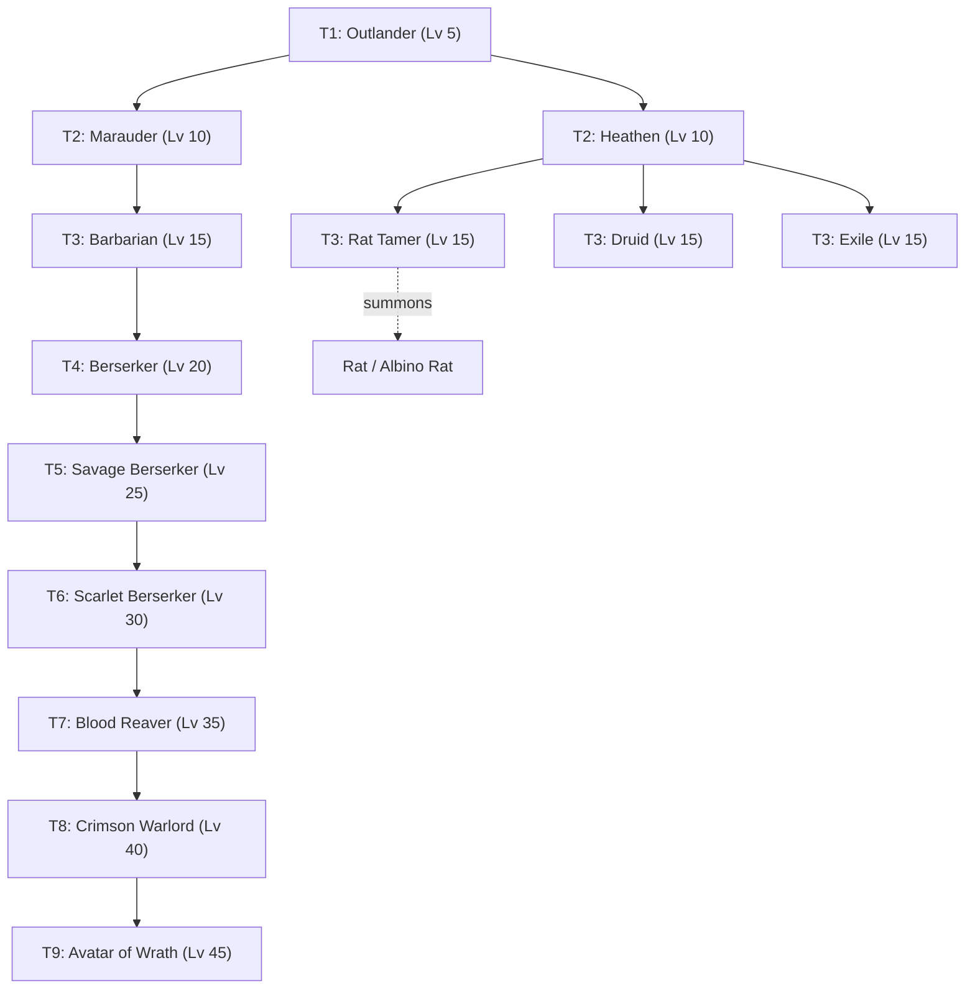

# Implementation Plan: Outlander Expansion & Reference Integration

## 1. Goal Description

Integrate the **Outlander** 5th base adventurer class family into *Idle Guild Master*, implementing the complete design, unit stats, skill logic, combat formulas, and visual assets provided in [reference/Outlander](file:///c:/Repositories/IGM-Modded/reference/Outlander).

This plan introduces:
1. **Outlander (Tier 1 Base Class)** in the tavern recruitment pool alongside Footman, Rogue, Archer, and Apprentice (20% each).
2. **Marauder / Berserker Progression (T2–T9)**: An 8-tier ferocious combat line specializing in health-threshold rage, consecutive attacks, lifesteal, and slaughter resets, culminating in **Avatar of Wrath (T9)**.
3. **Heathen Branch Foundations (T2–T3)**: The animist/companion root **Heathen (T2)** branching into **Rat Tamer (T3)** (summoning Rat/Albino Rat combat companions), **Druid (T3)** (nature entangle/magic), and **Exile (T3)** (evasive skirmisher).
4. **Three New Status Effects**: `RAGE` (+30% dmg dealt, +30% dmg taken), `ENTANGLE` (no dodge, -20% dmg dealt, 2% max HP DoT/turn), and `EVASION` (+25% flat additive dodge).
5. **Eight New Active Skills & Seven Passives**: Consecutive strike series (`ACTIVE_WILD_STRIKES`, `ACTIVE_BRUTAL_STRIKES`), kill-reset finishers (`ACTIVE_BLOODY_SLAUGHTER`, `ACTIVE_BLESSING_OF_SLAUGHTER`), and defensive stances.
6. **Primordial Champion**: A level 50 secret/hero tier unit with counterattacks and `ACTIVE_GARDE_ABSOLUE`.
7. **Berserker Slotting Migration**: Seamlessly reslotting the temporary standalone T9 Berserker to Tier 4 (Max Lv 20), anchoring the Marauder evolution tree.

---

## 2. Visual Assets & Resources

All 18 graphical assets are pre-made and located in [reference/Outlander](file:///c:/Repositories/IGM-Modded/reference/Outlander). They will be installed into `app/src/main/res/drawable/`:

| Source File | Destination Resource | Description |
| :--- | :--- | :--- |
| `unit_outlander.png` | `@drawable/unit_outlander` | Outlander (Tier 1) |
| `unit_marauder.png` | `@drawable/unit_marauder` | Marauder (Tier 2) |
| `Unit_Heathen.png` | `@drawable/unit_heathen` | Heathen (Tier 2) *(rename to lowercase)* |
| `unit_barbarian.png` | `@drawable/unit_barbarian` | Barbarian (Tier 3) |
| `unit_barbarian_hero.png` | `@drawable/unit_berserker_hero` | Berserker (Tier 4) |
| `unit_savage_berserker.png` | `@drawable/unit_savage_berserker` | Savage Berserker (Tier 5) |
| `unit_scarlet_berserker.png` | `@drawable/unit_scarlet_berserker` | Scarlet Berserker (Tier 6) |
| `unit_blood_reaver.png` | `@drawable/unit_blood_reaver` | Blood Reaver (Tier 7) |
| `unit_crimson_warlord.png` | `@drawable/unit_crimson_warlord` | Crimson Warlord (Tier 8) |
| `unit_avatar_of_wrath.png` | `@drawable/unit_avatar_of_wrath` | Avatar of Wrath (Tier 9) |
| `unit_druid.png` | `@drawable/unit_druid` | Druid (Tier 3) |
| `unit_exile.png` | `@drawable/unit_exile` | Exile (Tier 3) |
| `unit_tamer.png` | `@drawable/unit_rat_tamer` | Rat Tamer (Tier 3) |
| `unit_rat.png` | `@drawable/unit_rat` | Summoned Rat |
| `unit_albino_rat.png` | `@drawable/unit_albino_rat` | Summoned Albino Rat |
| `effect_entangle.png` | `@drawable/effect_entangle` | Status effect Entangle icon |
| `effect_evasion.png` | `@drawable/effect_evasion` | Status effect Evasion icon |
| `effect_rage.png` | `@drawable/effect_rage` | Status effect Rage icon |
| `rat_claws.png` | `@drawable/rat_claws` | Rat Claws weapon sprite |

---

## 3. Status Effects Specification

Register in [`StatusEffectType.kt`](file:///c:/Repositories/IGM-Modded/app/src/main/kotlin/it/paranoidsquirrels/idleguildmaster/storage/data/entities/StatusEffectType.kt):

```kotlin
ENTANGLE(R.string.status_effect_entangle, R.string.status_effect_entangle_desc, R.drawable.effect_entangle, true, false),
EVASION(R.string.status_effect_evasion, R.string.status_effect_evasion_desc, R.drawable.effect_evasion, false, true),
RAGE(R.string.status_effect_rage, R.string.status_effect_rage_desc, R.drawable.effect_rage, false, true),
```

### Combat Mechanics in [`Area.kt`](file:///c:/Repositories/IGM-Modded/app/src/main/kotlin/it/paranoidsquirrels/idleguildmaster/storage/data/places/Area.kt):
1. **RAGE**:
   - Outgoing damage: When attacker has `StatusEffectType.RAGE`, multiply damage dealt by $1.30$.
   - Incoming damage: When defender has `StatusEffectType.RAGE`, multiply damage taken by $1.30$.
2. **ENTANGLE**:
   - Dodge disable: Entangled units cannot dodge (effective dodge chance $= 0.0$).
   - Outgoing damage penalty: Entangled units deal $20\%$ reduced damage ($\times 0.80$).
   - Turn tick DoT: Entangled units take $2\%$ of their Max HP as damage each round.
3. **EVASION**:
   - Additive dodge boost: $+25\%$ flat dodge chance in `Area.kt` hit roll:
     ```kotlin
     val evasionBonus = if (entity2.positiveStatusEffects.any { it.type == StatusEffectType.EVASION }) 0.25 else 0.0
     dMax = Math.max(EFFECT_PROBABILITY, hitChance - entity2.calculateTotalFlatDodgeChance() - evasionBonus)
     ```

---

## 4. Skills & Abilities Specification

### 4.1 Active Skills

| Enum Entry | Display Name | Multiplier & Mechanism |
| :--- | :--- | :--- |
| `ACTIVE_WILD_STRIKES` | Wild Strikes | $125\%$ physical damage. $50\%$ chance to strike a 2nd time (retargets if enemy dies). |
| `ACTIVE_WILD_STRIKES_II` | Wild Strikes II | $150\%$ physical damage. $50\%$ chance to strike a 2nd time (retargets if enemy dies). |
| `ACTIVE_BRUTAL_STRIKES` | Brutal Strikes | $175\%$ physical damage. Cascading extra strikes: $75\% \to 50\% \to 25\%$ (retargets on death). |
| `ACTIVE_BRUTAL_STRIKES_II`| Brutal Strikes II | $225\%$ physical damage. Cascading extra strikes: $75\% \to 50\% \to 25\%$ (retargets on death). |
| `ACTIVE_BLOODY_SLAUGHTER`| Bloody Slaughter | $225\%$ physical damage, $2.0\times$ crit bonus. Cascading strikes: $85\% \to 60\% \to 35\%$. **Instantly recasts on kill**. |
| `ACTIVE_BLESSING_OF_SLAUGHTER` | Blessing of Slaughter | All living allies gain `RAGE` for 3 turns. Deals $250\%$ physical damage ($2.0\times$ crit). Cascading strikes: $85\% \to 60\% \to 35\%$. **Instantly recasts on kill**. |
| `ACTIVE_EN_AVANT` | En Avant | Self-applies `FRENZY` for 5 turns. Strikes 2 targets for $250\%$ damage. |
| `ACTIVE_GARDE_ABSOLUE` | Garde Absolue | Self-applies `DEFENSIVE_STANCE` for 999 turns. Strikes for $250\%$ damage, gains shield equal to $50\%$ of damage dealt (capped at $20\%$ max HP). |

### 4.2 Passive Skills

| Enum Entry | Display Name | Effect |
| :--- | :--- | :--- |
| `PASSIVE_RAGE` | Rage | When $\text{HP} \le 50\%$, $50\%$ chance for extra basic attack at end of turn. |
| `PASSIVE_BERSERKERR_RAGE` | Berserker Rage | When $\text{HP} < 50\%$, gains `RAGE` (2 turns) and grants guaranteed extra basic attack at end of turn. |
| `PASSIVE_SAVAGE_RAGE` | Savage Rage | When $\text{HP} < 50\%$, gains `RAGE` (2 turns) and guaranteed extra attack at end of turn. $+25\%$ lifesteal. |
| `PASSIVE_SAVAGE_RAGE_II`| Savage Rage II | When $\text{HP} < 75\%$, gains `RAGE` (2 turns) and guaranteed extra attack at end of turn. $+25\%$ lifesteal. |
| `PASSIVE_NATURES_HAND` | Nature's Hand | Attacks have a $75\%$ chance to apply `ENTANGLE` (2 turns). |
| `PASSIVE_RAT_CALLER` | Rat Tamer | At end of turn, summons a `Rat` ($15\%$ chance `AlbinoRat`). Max 4 live rats. |
| `PASSIVE_FOCUSED_EYE` | Focused Eye | Attacks have a $15\%$ chance to gain `EVASION` (2 turns). |
| `PASSIVE_DEFENSIVE_SWORD_MASTERY` | Defensive Sword Mastery | Mastery passive for Primordial Champion. |

---

## 5. Class Tree Architecture & Unit Definitions



### Unit Stat Matrix

| Class | Tier | Max Lv | HP | CON | INT | DEX | DEF | MDEF | CON Scale | Lifesteal | Active Skill | Passive Skill | End-of-Turn Action |
| :--- | :--- | :--- | :--- | :--- | :--- | :--- | :--- | :--- | :--- | :--- | :--- | :--- | :--- |
| **Outlander** | T1 | 5 | 42 | 9 | 2 | 4 | 5 | 5 | 1.00 | 0 | `ACTIVE_MIGHTY_STRIKE` | `PASSIVE_NONE` | None |
| **Marauder** | T2 | 10 | 60 | 14 | 6 | 3 | 10 | 10 | 1.05 | 0 | `ACTIVE_WILD_STRIKES` | `PASSIVE_RAGE` | Extra attack if HP $\le 50\%$ (50% proc) |
| **Barbarian** | T3 | 15 | 85 | 15 | 9 | 3 | 10 | 10 | 1.05 | 0 | `ACTIVE_BRUTAL_STRIKES` | `PASSIVE_RAGE` | Extra attack if HP $\le 50\%$ (50% proc) |
| **Berserker** | T4 | 20 | 125 | 17 | 10 | 3 | 10 | 10 | 1.05 | 0 | `ACTIVE_BRUTAL_STRIKES` | `PASSIVE_BERSERKERR_RAGE` | Extra attack + Rage if HP $< 50\%$ |
| **SavageBerserker**| T5 | 25 | 170 | 25 | 13 | 4 | 10 | 10 | 1.05 | 25% | `ACTIVE_BRUTAL_STRIKES` | `PASSIVE_SAVAGE_RAGE` | Extra attack + Rage if HP $< 50\%$ |
| **ScarletBerserker**| T6 | 30 | 200 | 31 | 15 | 4 | 15 | 15 | 1.05 | 25% | `ACTIVE_BRUTAL_STRIKES_II`| `PASSIVE_SAVAGE_RAGE` | Extra attack + Rage if HP $< 50\%$ |
| **BloodReaver** | T7 | 35 | 230 | 35 | 18 | 5 | 17 | 17 | 1.10 | 25% | `ACTIVE_BLOODY_SLAUGHTER` | `PASSIVE_SAVAGE_RAGE` | Extra attack + Rage if HP $< 50\%$ |
| **CrimsonWarlord** | T8 | 40 | 280 | 39 | 22 | 7 | 20 | 20 | 1.15 | 25% | `ACTIVE_BLOODY_SLAUGHTER` | `PASSIVE_SAVAGE_RAGE_II` | Extra attack + Rage if HP $< 75\%$ |
| **AvatarOfWrath** | T9 | 45 | 320 | 44 | 25 | 7 | 25 | 25 | 1.30 | 25% | `ACTIVE_BLESSING_OF_SLAUGHTER` | `PASSIVE_SAVAGE_RAGE_II`| Extra attack + Rage if HP $< 75\%$ |
| **Heathen** | T2 | 10 | 50 | 11 | 9 | 3 | 10 | 10 | 1.00 | 0 | `ACTIVE_WILD_STRIKES_II`| `PASSIVE_NONE` | None |
| **Druid** | T3 | 15 | 65 | 16 | 12 | 4 | 10 | 10 | 1.00 | 0 | `ACTIVE_WILD_STRIKES_II`| `PASSIVE_NATURES_HAND` | Turn-end Entangle status |
| **RatTamer** | T3 | 15 | 70 | 13 | 10 | 8 | 10 | 10 | 1.00 | 0 | `ACTIVE_WILD_STRIKES` | `PASSIVE_RAT_CALLER` | `SUMMON_RAT` |
| **Exile** | T3 | 15 | 75 | 12 | 6 | 12 | 10 | 10 | 1.00 | 0 | `ACTIVE_WILD_STRIKES` | `PASSIVE_FOCUSED_EYE` | None |
| **Rat** | Minion | 15 | 10 | 5 | 5 | 5 | 0 | 0 | 1.00 | 0 | `ACTIVE_NONE` | `PASSIVE_NONE` | None |
| **AlbinoRat** | Minion | 15 | 15 | 8 | 8 | 8 | 0 | 0 | 1.00 | 0 | `ACTIVE_NONE` | `PASSIVE_NONE` | None |
| **PrimordialChampion**| T10 | 50 | 440 | 50 | 16 | 25 | 25 | 25 | 1.50 | 0 | `ACTIVE_GARDE_ABSOLUE` | `PASSIVE_DEFENSIVE_SWORD_MASTERY`| Extra attack (25% proc), 80% counter |

---

## 6. Companion Summoning Engine (`Rat` & `Albino Rat`)

1. **`EndOfTurnAction.SUMMON_RAT`**:
   - Added to [`EndOfTurnAction.kt`](file:///c:/Repositories/IGM-Modded/app/src/main/kotlin/it/paranoidsquirrels/idleguildmaster/storage/data/entities/EndOfTurnAction.kt).
2. **`summonRat(entity: Entity)` in [`Area.kt`](file:///c:/Repositories/IGM-Modded/app/src/main/kotlin/it/paranoidsquirrels/idleguildmaster/storage/data/places/Area.kt)**:
   - Check if current active summoned rat count $< 4$.
   - Roll $15\%$ chance for `AlbinoRat` vs $85\%$ for `Rat`.
   - Instantiate via `Adventurer.getInstance("Rat" / "AlbinoRat", -100, 1, 0, ...)`.
   - Assign weapon `rat.weapon = Item.getInstance("RatClaws") as? Weapon` (using `@drawable/rat_claws`, $+1\text{ CON}$, $+1\text{ DEX}$, $+5\%\text{ Crit Chance}$).
   - Set `rat.summonedMinion = true`, set HP to full, and insert next to the tamer in `fightingGroup` and `adventurersExploring`.
3. **Decay Exemption**:
   - In [`Adventurer.decay()`](file:///c:/Repositories/IGM-Modded/app/src/main/kotlin/it/paranoidsquirrels/idleguildmaster/storage/data/entities/adventurers/Adventurer.kt#L569):
     ```kotlin
     if (summonedMinion && getTrueClass() != "Rat" && getTrueClass() != "AlbinoRat") {
         d = Math.max(1.0, d + (totalMaxHp.toDouble() * 0.25))
     }
     ```
     Summoned rats do not suffer the 25% necrotic decay that applies to undead skeleton/zombie minions.

---

## 7. Tavern Recruitment & Base Class Handling

1. **Tavern Rolling**:
   - In [`Utils.rollClass()`](file:///c:/Repositories/IGM-Modded/app/src/main/kotlin/it/paranoidsquirrels/idleguildmaster/Utils.kt#L179-L187):
     ```kotlin
     private fun rollClass(): String {
         val dRandom = random()
         return when {
             dRandom < 0.20 -> "Footman"
             dRandom < 0.40 -> "Rogue"
             dRandom < 0.60 -> "Archer"
             dRandom < 0.80 -> "Outlander"
             else -> "Apprentice"
         }
     }
     ```
2. **Base Class Resolution**:
   - In `Utils.getBaseClass(adventurer: Adventurer)`:
     ```kotlin
     if (adventurer.getTrueClass() in listOf(
         "Outlander", "Marauder", "Barbarian", "Berserker",
         "SavageBerserker", "ScarletBerserker", "BloodReaver",
         "CrimsonWarlord", "AvatarOfWrath", "Heathen", "RatTamer",
         "Druid", "Exile", "PrimordialChampion"
     )) {
         return "Outlander"
     }
     ```

---

## 8. Weapon & Equipment Integration Strategy

- **Phase A (Initial Parity with Reference Code)**:
  - As configured in the reference unit files, Outlanders, Marauders, and Berserkers use `weaponType = R.string.type_sword` and `armorType = R.string.type_armor_light`. Druids use `weaponType = R.string.type_staff`.
  - When promoting between branches (e.g. Outlander $\to$ Druid), [`DialogPromotionChoices.kt`](file:///c:/Repositories/IGM-Modded/app/src/main/kotlin/it/paranoidsquirrels/idleguildmaster/ui/dialogs/DialogPromotionChoices.kt#L93-L107) already safely unequips unsuited weapons/armors and provides the class fallback.
- **Phase B (Axe Weapon Integration)**:
  - Once the Axe system from [`axe-weapon-type.md`](file:///c:/Repositories/IGM-Modded/plans/planned/crafting/axe-weapon-type.md) is implemented, Outlander, Marauder, and Berserker units can be switched to `R.string.type_axe` seamlessly.

---

## 9. Phased Execution Roadmap

### Phase 1: Assets, Strings & Status Engine
1. Copy all 18 PNG files from `reference/Outlander` to `app/src/main/res/drawable/` (with lowercase resource names).
2. Add all class names, descriptions, active skills, passive skills, and status effect strings to `strings.xml`.
3. Add `ENTANGLE`, `EVASION`, and `RAGE` to `StatusEffectType.kt`.
4. Implement damage amplification, damage taken increase, and dodge modifiers in `Area.kt` for `RAGE`, `ENTANGLE`, and `EVASION`.

### Phase 2: Active & Passive Combat Skills
1. Register the 8 active skills and 8 passive skills in `Skills.kt`.
2. Implement execution handlers in `Area.cast()` for:
   - `ACTIVE_WILD_STRIKES` & `ACTIVE_WILD_STRIKES_II`
   - `ACTIVE_BRUTAL_STRIKES` & `ACTIVE_BRUTAL_STRIKES_II`
   - `ACTIVE_BLOODY_SLAUGHTER` & `ACTIVE_BLESSING_OF_SLAUGHTER` (recast on kill)
   - `ACTIVE_EN_AVANT` & `ACTIVE_GARDE_ABSOLUE`
3. Wire passive trigger logic for `PASSIVE_NATURES_HAND` (Entangle on hit) and `PASSIVE_FOCUSED_EYE` (Evasion on hit).

### Phase 3: Outlander & Marauder Progression (T1–T9)
1. Create `Outlander.kt` (T1).
2. Integrate `Marauder.kt` (T2), `Barbarian.kt` (T3), `Berserker.kt` (T4), `SavageBerserker.kt` (T5), `ScarletBerserker.kt` (T6), `BloodReaver.kt` (T7), `CrimsonWarlord.kt` (T8), and `AvatarOfWrath.kt` (T9).
3. Update `Utils.rollClass()` to 20% distribution and `Utils.getBaseClass()`.
4. Integrate `PrimordialChampion.kt`.
5. Update `ModFeaturesTest.kt` to reflect Berserker as T4 and Avatar of Wrath as T9 apex.

### Phase 4: Heathen, Rat Tamer, Druid, and Exile (T2–T3)
1. Integrate `Heathen.kt` (T2).
2. Create `RatTamer.kt`, `Rat.kt`, `AlbinoRat.kt`, and `RatClaws.kt`.
3. Add `EndOfTurnAction.SUMMON_RAT` and implement `summonRat()` in `Area.kt`.
4. Exempt rat minions from decay in `Adventurer.decay()`.
5. Integrate `Druid.kt` and create `Exile.kt`.

### Phase 5: Verification & Testing
1. Run JVM test suite (`./gradlew.bat testDebugUnitTest`).
2. Add dedicated test cases in `ModFeaturesTest.kt` verifying:
   - Outlander roll rate and instantiation.
   - Berserker $\to$ Avatar of Wrath evolution chain.
   - Rage status damage multiplier (+30% dealt, +30% taken).
   - Entangle dodge prevention and DoT.
   - Evasion dodge boost.
   - Rat summoning and non-decay.
   - Bloody Slaughter recast on target death.

---

## 10. Risk Assessment & Mitigations

1. **Berserker Save Compatibility**:
   - *Risk*: Players with an existing modded level 45 Berserker may experience stat shifts when Berserker max level becomes 20.
   - *Mitigation*: Existing level 45 Berserkers can either be auto-promoted to Avatar of Wrath or clamped cleanly by the tolerant save deserializer.
2. **Infinite Recast Loops**:
   - *Risk*: `ACTIVE_BLOODY_SLAUGHTER` and `ACTIVE_BLESSING_OF_SLAUGHTER` recast on kill. If an enemy respawns or wave is infinite, loop could lock up.
   - *Mitigation*: The `do { ... } while (recast)` loop terminates immediately if no living enemy target can be found (`selectTargets(...)?.firstOrNull() ?: break`).
3. **Android Resource Naming**:
   - *Risk*: `Unit_Heathen.png` contains uppercase characters, which causes Android AAPT build failure.
   - *Mitigation*: Renamed to `unit_heathen.png` upon copying.
