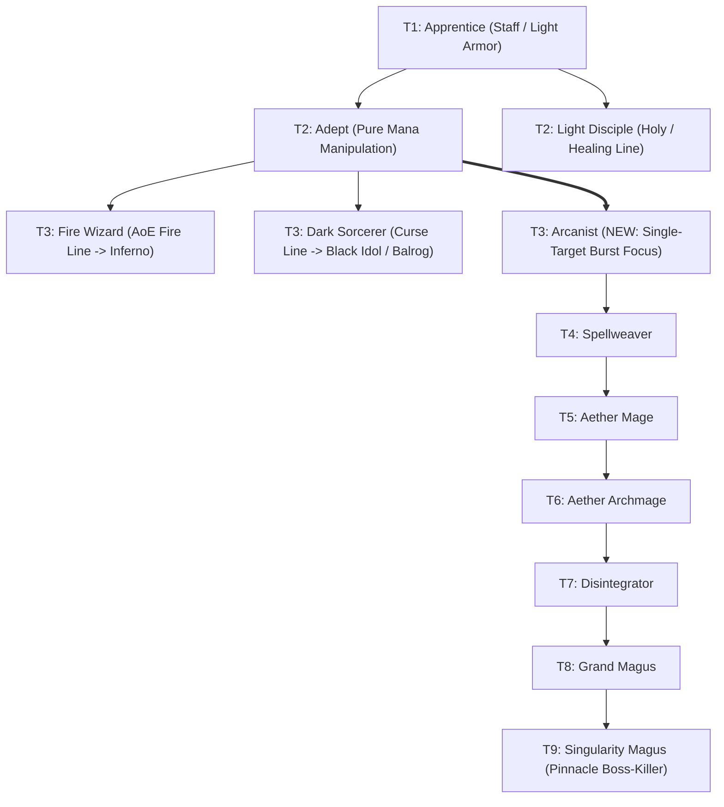

# Implementation Plan: Single-Target Burst Mage Line (Apprentice Branch)

## 1. Goal Description

Introduce a dedicated **Single-Target Burst Mage** evolution line branching from the **Apprentice** class tree, providing a focused boss-killer and elite-assassin archetype to contrast with existing AoE mages like **Inferno** (Fire AoE / Meteors) and **Balrog** (Chaos AoE / Whip & Tear).

All mechanics, active skills, and passives are designed to be strictly **progressive** across all 9 tiers, with grounded and balanced damage numbers that prevent game-breaking burst when combined with high mana regeneration.

---

## 2. Design Problem & Strategic Identity

### The Current Mage Landscape
In vanilla *Idle Guild Master*, all offensive mage evolutions dilute their power across the entire enemy encounter:
- **Fire Line** (`FireWizard` $\to$ `Inferno`): Multi-target burn, AoE fireballs, and board-wide meteors (`ACTIVE_METEOR_II`).
- **Darkness / Curse Line** (`DarkSorcerer` $\to$ `BlackIdol`): Multi-target debuffs, curses, DoTs, and minion summons.
- **Demonic Line** (`Unchained` $\to$ `Balrog`): Chaotic multi-target physical/magical whips and cleaves (`ACTIVE_WHIP_AND_TEAR`).
- **Holy Line** (`LightDisciple` $\to$ `Archangel`): Defensive party healing, shielding, and radiant auras.

### The Missing Niche: The Single-Target Magic Assassin
In high-tier dungeons, raids, and boss encounters (e.g. Kaunis, The Ancient, Sanguine Crucible, Archmagus Valthex, Slime King):
1. AoE spells feature lower damage multipliers to balance hitting up to 5 targets.
2. High-threat single targets (raid bosses, enemy healers, backline casters) survive AoE chip damage and retaliate.
3. The **Arcanist** line fills this gap by channeling pure, concentrated mana into single-target lance strikes, spell critical strikes, magic defense penetration, and steady end-of-turn Arcane Darts.

---

## 3. Class Tree Architecture & Branching

The new line branches directly from **Adept** (Tier 2), providing a third distinct choice alongside `FireWizard` and `DarkSorcerer`:



---

## 4. Core Combat Mechanics & Balanced Scaling Profile

### 4.1 Skill Naming Evolution Rule
A skill family name only changes when a **new foundational mechanic** is introduced. Within that mechanical stage, it scales using Roman numerals (`I`, `II`, `III`):
- **Tiers 1–3 (`ACTIVE_ENERGY_BURST_I..III`)**: Pure single-target magic damage scaling from `1.5x` $\to$ `2.0x` $\to$ `2.5x`. T3 continues as `ACTIVE_ENERGY_BURST_III` because it shares the same pure burst mechanic as T1 and T2.
- **Tiers 4–6 (`ACTIVE_ARCANE_BLAST_I..III`)**: Introduces **Magic Defense Penetration** (10% $\to$ 15% $\to$ 20% MDEF Pierce, damage scaling `3.0x` $\to$ `3.5x` $\to$ `4.0x`).
- **Tiers 7–9 (`ACTIVE_DISINTEGRATE_I..III`)**: Introduces **Execution Thresholds** (10% $\to$ 15% $\to$ 20% Execute, MDEF pierce `25%` $\to$ `30%` $\to$ `35%`, damage scaling `4.5x` $\to$ `5.0x` $\to$ `5.5x`).
- **Weapon & Armor**: Staff (`R.string.type_staff`), Light Armor (`R.string.type_armor_light`), Potion Profile `PotionDrinkerType.MAGE`.

### 4.2 Progressive Passive: Aether Resonance (Crit + Arcane Darts)
The passive family is unified under **`PASSIVE_AETHER_RESONANCE_I`** through **`VII`**.
In *Idle Guild Master*, passives that grant end-of-turn actions (like `PASSIVE_PYROMANCY_I` & `II` on Melting Elder/Inferno) define their extra attacks in both code and description:
- **Spell Critical Strike Focus**: Progressively grants +5% up to +18% Critical Strike Chance, and +0% up to +40% Critical Damage.
- **Arcane Darts (End-of-Turn Action)**: After attacking, fires 1 to 3 concentrated Arcane Darts at the target. The darts deal reliable flat magic damage, maintaining steady single-target pressure between skill casts without exploding damage spikes.

---

## 5. Tier-by-Tier Evolution Specifications

Every tier strictly and logically improves upon the previous tier in base multiplier, MDEF pierce, execution threshold, crit bonus, and Arcane Darts:

| Tier | Class Name | Max Lv | HP | INT | DEX | Active Skill | Active Skill Effect | Passive Skill | Passive Description & Arcane Darts |
| :--- | :--- | :--- | :--- | :--- | :--- | :--- | :--- | :--- | :--- |
| **T1** | `Apprentice` | 5 | 20 | 10 | 4 | `ACTIVE_ENERGY_BURST_I` | 1.5x Single Magic Damage | `PASSIVE_NONE` | None |
| **T2** | `Adept` | 10 | 25 | 15 | 5 | `ACTIVE_ENERGY_BURST_II`| 2.0x Single Magic Damage | `PASSIVE_NONE` | None |
| **T3** | `Arcanist` | 15 | 35 | 21 | 6 | `ACTIVE_ENERGY_BURST_III`| 2.5x Single Magic Damage | `PASSIVE_AETHER_RESONANCE_I` | +5% Crit. Fires **1 Arcane Dart** (15 magic dmg) after attacking. |
| **T4** | `Spellweaver`| 20 | 50 | 28 | 8 | `ACTIVE_ARCANE_BLAST_I` | 3.0x Single Magic, pierces 10% MDEF | `PASSIVE_AETHER_RESONANCE_II` | +7% Crit, +10% Crit Dmg. Fires **1 Arcane Dart** (25 magic dmg). |
| **T5** | `AetherMage` | 25 | 70 | 36 | 10 | `ACTIVE_ARCANE_BLAST_II`| 3.5x Single Magic, pierces 15% MDEF | `PASSIVE_AETHER_RESONANCE_III` | +9% Crit, +15% Crit Dmg. Fires **1 Arcane Dart** (40 magic dmg). |
| **T6** | `AetherArchmage`| 30 | 95 | 45 | 12 | `ACTIVE_ARCANE_BLAST_III`| 4.0x Single Magic, pierces 20% MDEF | `PASSIVE_AETHER_RESONANCE_IV` | +11% Crit, +20% Crit Dmg. Fires **2 Arcane Darts** (35 magic dmg each). |
| **T7** | `Disintegrator`| 35 | 130 | 54 | 14 | `ACTIVE_DISINTEGRATE_I` | 4.5x Single Magic, pierces 25% MDEF, 10% Execute | `PASSIVE_AETHER_RESONANCE_V` | +13% Crit, +25% Crit Dmg. Fires **2 Arcane Darts** (50 magic dmg each). |
| **T8** | `GrandMagus` | 40 | 170 | 64 | 16 | `ACTIVE_DISINTEGRATE_II`| 5.0x Single Magic, pierces 30% MDEF, 15% Execute | `PASSIVE_AETHER_RESONANCE_VI` | +15% Crit, +30% Crit Dmg. Fires **2 Arcane Darts** (65 magic dmg each). |
| **T9** | `SingularityMagus`| 45 | 220 | 75 | 18 | `ACTIVE_DISINTEGRATE_III`| **5.5x Single Magic**, pierces 35% MDEF, **20% Execute** | `PASSIVE_AETHER_RESONANCE_VII`| **+18% Crit, +40% Crit Dmg**. Fires **3 Arcane Darts** (60 magic dmg each). |

---

## 6. Balanced Mathematical Damage Profile

To verify balance, let's examine combat against a representative high-tier boss:

$$\text{Boss Context: Single Target, 10,000 HP, 40 Magic Defense}$$

### Scenario A: AoE Mage (Inferno - T9)
- **Active Skill** (`ACTIVE_METEOR_II`): 2.5x base damage across all enemies.
- Damage vs Boss: $\sim 300 - 450$ damage per cast.
- Excels at clearing 5-enemy encounter waves simultaneously, but requires many turns to kill a solitary 10,000 HP boss.

### Scenario B: Single-Target Burst Mage (Singularity Magus - T9)
- **Active Skill** (`ACTIVE_DISINTEGRATE_III`): 5.5x base damage + 35% MDEF pierce (boss MDEF reduced from 40 to 26).
  - Normal Hit: $\sim 380 - 480$ damage.
  - Critical Hit (with +40% Crit Dmg passive $\to$ 1.9x multiplier): $\sim 720 - 900$ damage.
- **End-of-Turn Arcane Darts**: 3 darts $\times$ 60 damage = **180 flat magic damage** every turn.
- **Full 2-Turn Cycle** (Assuming player achieves 50 mana regen every 2 turns):
  - Turn 1 (Skill Cast): $\sim 450$ (or $\sim 800$ crit) + 180 (Darts) = **$\sim 630 - 980$ total damage**.
  - Turn 2 (Basic Attack): $\sim 65$ attack + 180 (Darts) = **$\sim 245$ total damage**.
  - **Total 2-Turn Output**: **$\sim 875 - 1,225$ damage**.
- **Execution**: When the boss falls below 20% HP (2,000 HP), the active skill automatically executes it.

*Result*: 
- A 10,000 HP raid boss takes approximately **7 to 8 combat cycles** to defeat rather than being trivialized in 1 or 2 turns.
- It delivers roughly **2.5x the single-target boss DPS** of an AoE mage like Inferno, while remaining completely balanced within the game's mathematical health pools.

---

## 7. System & Architectural Integration

### 7.1 Promotion Routing in `Adept.kt`
In [`Adept.kt`](file:///c:/Repositories/IGM-Modded/app/src/main/kotlin/it/paranoidsquirrels/idleguildmaster/storage/data/entities/adventurers/units/Adept.kt#L25-L27):
```kotlin
nextClasses.add("FireWizard")
nextClasses.add("DarkSorcerer")
nextClasses.add("Arcanist") // New 3rd promotion branch
```

### 7.2 Active Skill Handlers in `Area.kt`
In [`Area.kt`](file:///c:/Repositories/IGM-Modded/app/src/main/kotlin/it/paranoidsquirrels/idleguildmaster/storage/data/places/Area.kt#L1772):
```kotlin
Skills.ACTIVE_ENERGY_BURST_I -> skill.setTargetSelectionMode(TARGET_RANDOM_ENEMY)
    .setDamageAmplification(1.5).setForceRange(true).execute()

Skills.ACTIVE_ENERGY_BURST_II -> skill.setTargetSelectionMode(TARGET_RANDOM_ENEMY)
    .setDamageAmplification(2.0).setForceRange(true).execute()

Skills.ACTIVE_ENERGY_BURST_III -> skill.setTargetSelectionMode(TARGET_RANDOM_ENEMY)
    .setDamageAmplification(2.5).setForceRange(true).execute()

Skills.ACTIVE_ARCANE_BLAST_I -> skill.setTargetSelectionMode(TARGET_RANDOM_ENEMY)
    .setDamageAmplification(3.0).setForceMagic(true).execute()

Skills.ACTIVE_ARCANE_BLAST_II -> skill.setTargetSelectionMode(TARGET_RANDOM_ENEMY)
    .setDamageAmplification(3.5).setForceMagic(true).execute()

Skills.ACTIVE_ARCANE_BLAST_III -> skill.setTargetSelectionMode(TARGET_RANDOM_ENEMY)
    .setDamageAmplification(4.0).setForceMagic(true).execute()

Skills.ACTIVE_DISINTEGRATE_I -> skill.setTargetSelectionMode(TARGET_RANDOM_ENEMY)
    .setDamageAmplification(4.5).setExecutionThreshold(0.10).setForceMagic(true).execute()

Skills.ACTIVE_DISINTEGRATE_II -> skill.setTargetSelectionMode(TARGET_RANDOM_ENEMY)
    .setDamageAmplification(5.0).setExecutionThreshold(0.15).setForceMagic(true).execute()

Skills.ACTIVE_DISINTEGRATE_III -> skill.setTargetSelectionMode(TARGET_RANDOM_ENEMY)
    .setDamageAmplification(5.5).setExecutionThreshold(0.20).setForceMagic(true).execute()
```

### 7.3 End-of-Turn Actions in `EndOfTurnAction.kt` & Adventurers
In `EndOfTurnAction.kt`:
```kotlin
ARCANE_DART_15(flatDamage = true, damage = 15, forceMagic = true),
ARCANE_DART_25(flatDamage = true, damage = 25, forceMagic = true),
ARCANE_DART_40(flatDamage = true, damage = 40, forceMagic = true),
ARCANE_DART_35(flatDamage = true, damage = 35, forceMagic = true),
ARCANE_DART_50(flatDamage = true, damage = 50, forceMagic = true),
ARCANE_DART_65(flatDamage = true, damage = 65, forceMagic = true),
ARCANE_DART_60(flatDamage = true, damage = 60, forceMagic = true);
```
Each class overrides `endOfTurnActions()` (similar to `Inferno.kt` and `MeltingElder.kt` with `EXTRA_ATTACK_1`) to add 1, 2, or 3 darts matching its passive.

### 7.4 Localization & Strings (`strings.xml`)
- Add unit names & descriptions for `Arcanist`, `Spellweaver`, `AetherMage`, `AetherArchmage`, `Disintegrator`, `GrandMagus`, `SingularityMagus`.
- Add skill names & descriptions for `ACTIVE_ENERGY_BURST_III`, `ACTIVE_ARCANE_BLAST_I..III`, `ACTIVE_DISINTEGRATE_I..III`.
- Add passive names & descriptions for `PASSIVE_AETHER_RESONANCE_I..VII`, explicitly noting the Crit bonuses and the Arcane Dart count & damage.

---

## 8. Verification & Testing Plan

- [ ] Unit test: Verify `Adept` contains 3 promotion options (`FireWizard`, `DarkSorcerer`, `Arcanist`).
- [ ] Unit test: Verify class instantiation and stat growth across all tiers (T3 `Arcanist` to T9 `SingularityMagus`).
- [ ] Unit test: Verify `ACTIVE_DISINTEGRATE_III` correctly hits a single enemy with a 5.5x multiplier and triggers the 20% execution threshold.
- [ ] Unit test: Verify `PASSIVE_AETHER_RESONANCE_VII` applies +18% crit, +40% crit damage, and adds 3 Arcane Darts to `endOfTurnActions()`.
- [ ] Build & Test: `./gradlew testDebugUnitTest` passes with 0 failures.
