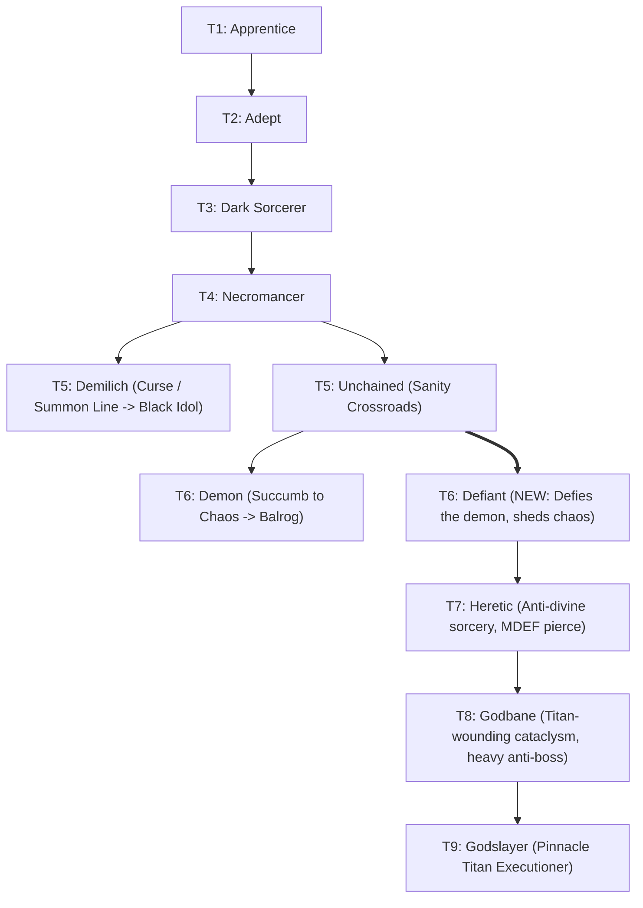

# Implementation Plan: Single-Target Burst Mage Line (Unchained Branch: Godslayer)

## 1. Goal Description & Lore

Introduce a dedicated **Single-Target Burst Mage & Boss-Killer** evolution line branching from **Tier 5 Unchained**:
$$\text{Unchained (T5)} \longrightarrow \text{Defiant (T6)} \longrightarrow \text{Heretic (T7)} \longrightarrow \text{Godbane (T8)} \longrightarrow \text{Godslayer (T9)}$$

### The Lore: Stolen Divinity & Vengeance Against the Gods
In vanilla *Idle Guild Master*, an Apprentice walking the dark path (`Apprentice` $\to$ `Adept` $\to$ `DarkSorcerer` $\to$ `Necromancer`) breaks free from necromantic slavery to become **Unchained (T5)**. However, that freedom was a cruel deception: an infernal demon was secretly bound into their soul, driving them into mindless bloodlust (`PASSIVE_CHAOTIC`).

In the vanilla path (`Demon` $\to$ `InfernalLord` $\to$ `InfernalPrince` $\to$ `Balrog`), the mage completely succumbs to the demonic corruption, losing their humanity and lashing out in chaotic friendly-fire AoE.

**The Godslayer Path is the path of defiance**:
1. **T6 (Defiant)**: The Unchained **regains their sanity**. Furious at being deceived by dark forces, they defy the entity inside them, subjugating the demon and bending that stolen primordial rage into disciplined focus. They shed all chaotic madness and friendly fire.
2. **T7 (Heretic)**: Rejecting both infernal masters and celestial deities, the Heretic weaponizes stolen dark sorcery into anti-divine magic that unravels sacred wards and pierces magic defenses.
3. **T8 (Godbane)**: No longer merely a mortal sorcerer, they become a living poison against immortals—their attacks wound titans and colossi with devastating single-target force.
4. **T9 (Godslayer)**: The pinnacle titan-killer dedicated to slaying deities, demons, and raid bosses with absolute single-target obliteration.

---

## 2. Strategic Identity & Contrast

| Dimension | The Demonic AoE Path (`Demon` $\to$ `Balrog`) | The Godslayer Burst Path (`Defiant` $\to$ `Godslayer`) |
| :--- | :--- | :--- |
| **Theme** | Mindless demonic possession, hellfire, chaotic madness | Reclaimed sanity, defiance, stolen divinity weaponized |
| **Passive** | `PASSIVE_CHAOTIC` (Strikes allies for friendly fire) | `PASSIVE_STOLEN_DIVINITY` (High Crit + Massive % Damage against Bosses) |
| **Targeting** | Board-wide chaos / cleaves (`all_except_self`) | Pure single-target focus (`TARGET_RANDOM_ENEMY`) |
| **Primary Role** | High-risk multi-target wave clearing | Elite assassin & dedicated **Boss-Killer** (`isBoss()`) |
| **Mechanics** | High raw damage spread across all targets | High single-target multiplier + MDEF Piercing + Anti-Boss scaling |

---

## 3. Class Tree Architecture & Branching

The new single-target burst line branches directly at **Unchained (Tier 5)**:


```mermaid
graph TD
    T1["T1: Apprentice"] --> T2A["T2: Adept"]
    T2A --> T3D["T3: Dark Sorcerer"]
    T3D --> T4N["T4: Necromancer"]
    
    %% Necromancer split
    T4N --> T5L["T5: Demilich (Curse / Summon Line -> Black Idol)"]
    T4N --> T5U["T5: Unchained (Sanity Crossroads)"]
    
    %% Unchained Split
    T5U --> T6D["T6: Demon (Succumb to Chaos -> Balrog)"]
    T5U ==> T6DF["T6: Defiant (NEW: Defies the demon, sheds chaos)"]
    
    %% Godslayer Progression
    T6DF --> T7H["T7: Heretic (Anti-divine sorcery, MDEF pierce)"]
    T7H --> T8GB["T8: Godbane (Titan-wounding cataclysm, heavy anti-boss)"]
    T8GB --> T9GS["T9: Godslayer (Pinnacle Titan Executioner)"]
```

---

## 4. Core Combat Mechanics & Progression

### 4.1 Reclaiming Sanity: No Friendly Fire
Upon evolving from `Unchained` to `Defiant`, the mage sheds `PASSIVE_CHAOTIC`. All active spells target **enemies only** (`TARGET_RANDOM_ENEMY`), completely removing friendly-fire danger from party formations.

### 4.2 Progressive Active Skills: Single-Target Magic Defense Pierce
Instead of multi-target spread or execution thresholds, the active skills channel pure concentrated destructive energy that cuts directly through enemy resistance:
- **T6 (`Defiant`) - `ACTIVE_DEFIANT_LANCE`**: Concentrates stolen infernal essence into a high-velocity piercing lance.
  - Multiplier: **3.5x Single Magic Damage**
  - Defense: Pierces **15% Magic Defense (MDEF)**
- **T7 (`Heretic`) - `ACTIVE_HERETIC_SPEAR`**: Anti-divine sorcery that shatters protective wards.
  - Multiplier: **4.5x Single Magic Damage**
  - Defense: Pierces **25% Magic Defense (MDEF)**
- **T8 (`Godbane`) - `ACTIVE_GODBANE_CATACLYSM`**: Unleashes an apocalyptic burst that obliterates single targets.
  - Multiplier: **5.5x Single Magic Damage**
  - Defense: Pierces **35% Magic Defense (MDEF)**
- **T9 (`Godslayer`) - `ACTIVE_GOD_CLEAVER`**: The ultimate strike that severs divine power.
  - Multiplier: **6.5x Single Magic Damage**
  - Defense: Pierces **45% Magic Defense (MDEF)**

### 4.3 Progressive Passive: Stolen Divinity (Dedicated Boss Killer)
The passive family is unified under **`PASSIVE_STOLEN_DIVINITY_I`** through **`IV`**. 
Rather than generic flat darts, the passive turns stolen demonic essence against apex predators, granting elevated spell critical strikes and a massive **bonus damage multiplier against Boss enemies (`isBoss()`)**:
- **T6 (`Defiant`) - `PASSIVE_STOLEN_DIVINITY_I`**:
  - **+20% Damage dealt against Bosses** (`isBoss()`)
  - +8% Critical Strike Chance
- **T7 (`Heretic`) - `PASSIVE_STOLEN_DIVINITY_II`**:
  - **+35% Damage dealt against Bosses** (`isBoss()`)
  - +12% Critical Strike Chance, +15% Critical Damage
- **T8 (`Godbane`) - `PASSIVE_STOLEN_DIVINITY_III`**:
  - **+50% Damage dealt against Bosses** (`isBoss()`)
  - +16% Critical Strike Chance, +25% Critical Damage
- **T9 (`Godslayer`) - `PASSIVE_STOLEN_DIVINITY_IV`**:
  - **+70% Damage dealt against Bosses** (`isBoss()`)
  - +20% Critical Strike Chance, +40% Critical Damage

---

## 5. Tier-by-Tier Specifications

| Tier | Class Name | Max Lv | HP | CON | INT | DEX | DEF | MDEF | Active Skill | Active Effect | Passive Skill | Passive Effect |
| :--- | :--- | :--- | :--- | :--- | :--- | :--- | :--- | :--- | :--- | :--- | :--- | :--- |
| **T5** | `Unchained` | 25 | 170 | 20 | 20 | 20 | 20 | 20 | `ACTIVE_FLAY` | 10.0x Magic, chaotic hit | `PASSIVE_CHAOTIC` | Friendly fire enabled |
| **T6** | `Defiant` | 30 | 220 | 22 | 36 | 24 | 15 | 25 | `ACTIVE_DEFIANT_LANCE` | **3.5x Magic**, pierces 15% MDEF | `PASSIVE_STOLEN_DIVINITY_I` | **+20% Dmg vs Bosses**, +8% Crit |
| **T7** | `Heretic` | 35 | 275 | 26 | 46 | 28 | 20 | 30 | `ACTIVE_HERETIC_SPEAR` | **4.5x Magic**, pierces 25% MDEF | `PASSIVE_STOLEN_DIVINITY_II` | **+35% Dmg vs Bosses**, +12% Crit, +15% Crit Dmg |
| **T8** | `Godbane` | 40 | 335 | 30 | 58 | 32 | 25 | 35 | `ACTIVE_GODBANE_CATACLYSM`| **5.5x Magic**, pierces 35% MDEF | `PASSIVE_STOLEN_DIVINITY_III`| **+50% Dmg vs Bosses**, +16% Crit, +25% Crit Dmg |
| **T9** | `Godslayer` | 45 | 400 | 34 | 72 | 36 | 30 | 40 | `ACTIVE_GOD_CLEAVER` | **6.5x Magic**, pierces 45% MDEF | `PASSIVE_STOLEN_DIVINITY_IV` | **+70% Dmg vs Bosses**, +20% Crit, +40% Crit Dmg |

- **Weapon Type**: Staff (`R.string.type_staff`)
- **Armor Type**: Light Armor (`R.string.type_armor_light`)
- **Potion Profile**: `PotionDrinkerType.MAGE`

---

## 6. Mathematical Boss-Killing Output

$$\text{Boss Scenario: Single Target Boss, 10,000 HP, 40 Magic Defense}$$

### Godslayer (T9) Performance:
- **Base Stats & Scaling**: 72 base INT + end-game Staff & gear $\to \sim 150 \text{ INT}$.
- **Active Cast (`ACTIVE_GOD_CLEAVER`)**:
  - Multiplier: **6.5x**
  - MDEF Penetration: Boss MDEF reduced from 40 to $40 \times (1 - 0.45) = \mathbf{22 \text{ MDEF}}$.
  - **Boss Multiplier (`PASSIVE_STOLEN_DIVINITY_IV`)**: $+70\%$ damage against Bosses ($\times 1.70$).
  - Normal Hit vs Boss: $\sim 1,000 - 1,200 \text{ damage}$.
  - Critical Hit vs Boss (+40% Crit Dmg $\to 1.9\times$ multiplier): $\sim 1,900 - 2,280 \text{ damage}$.
- **Basic Attack vs Boss**:
  - Normal Hit: $\sim 130 \text{ damage}$.
  - With +70% Boss Multiplier: $\sim 220 \text{ damage}$.
- **2-Turn Combat Cycle vs Boss** (Assuming skill cast every 2 turns):
  - Turn 1: $\sim 1,100$ (or $\sim 2,100$ crit).
  - Turn 2: $\sim 220$.
  - **Total 2-Turn Cycle**: $\mathbf{\sim 1,320 - 2,320 \text{ damage}}$.
- **Conclusion**:
  - Rather than spreading low damage across multiple enemies, the Godslayer chunks a 10,000 HP raid boss in just 5 to 7 combat cycles, making them the premier single-target boss assassin in the game.

---

## 7. System & Architectural Integration

### 7.1 Promotion Routing in `Unchained.kt`
In [`Unchained.kt`](file:///c:/Repositories/IGM-Modded/app/src/main/kotlin/it/paranoidsquirrels/idleguildmaster/storage/data/entities/adventurers/units/Unchained.kt#L25):
```kotlin
nextClasses.add("Demon")     // Vanilla AoE Chaos path
nextClasses.add("Defiant")   // NEW Single-Target Godslayer path
```

### 7.2 Skill Handlers in `Area.kt`
In [`Area.kt`](file:///c:/Repositories/IGM-Modded/app/src/main/kotlin/it/paranoidsquirrels/idleguildmaster/storage/data/places/Area.kt#L1772):
```kotlin
Skills.ACTIVE_DEFIANT_LANCE -> skill.setTargetSelectionMode(TARGET_RANDOM_ENEMY)
    .setDamageAmplification(3.5).setForceMagic(true).execute()

Skills.ACTIVE_HERETIC_SPEAR -> skill.setTargetSelectionMode(TARGET_RANDOM_ENEMY)
    .setDamageAmplification(4.5).setForceMagic(true).execute()

Skills.ACTIVE_GODBANE_CATACLYSM -> skill.setTargetSelectionMode(TARGET_RANDOM_ENEMY)
    .setDamageAmplification(5.5).setForceMagic(true).execute()

Skills.ACTIVE_GOD_CLEAVER -> skill.setTargetSelectionMode(TARGET_RANDOM_ENEMY)
    .setDamageAmplification(6.5).setForceMagic(true).execute()
```

### 7.3 Boss Damage Multiplier in `Area.dealDamage`
In [`Area.dealDamage()`](file:///c:/Repositories/IGM-Modded/app/src/main/kotlin/it/paranoidsquirrels/idleguildmaster/storage/data/places/Area.kt#L2483):
```kotlin
// Stolen Divinity passive: bonus damage against Bosses
val bossBonus = when (entity.passiveSkill) {
    Skills.PASSIVE_STOLEN_DIVINITY_I -> 0.20
    Skills.PASSIVE_STOLEN_DIVINITY_II -> 0.35
    Skills.PASSIVE_STOLEN_DIVINITY_III -> 0.50
    Skills.PASSIVE_STOLEN_DIVINITY_IV -> 0.70
    else -> 0.0
}
if (bossBonus > 0.0 && entity2 is Enemy && entity2.isBoss()) {
    livingCompanionBonusDamage *= (1.0 + bossBonus)
}
```
*(Note: `isBoss()` will be added to `Enemy` during implementation or checked via enemy tier/flag).*

### 7.4 New Unit Classes
Create four new classes under `storage/data/entities/adventurers/units/`:
- `Defiant.kt` (T6)
- `Heretic.kt` (T7)
- `Godbane.kt` (T8)
- `Godslayer.kt` (T9)

### 7.5 Localization & Strings (`strings.xml`)
- Add unit names & lore descriptions for `Defiant`, `Heretic`, `Godbane`, and `Godslayer`.
- Add skill names & descriptions for `ACTIVE_DEFIANT_LANCE`, `ACTIVE_HERETIC_SPEAR`, `ACTIVE_GODBANE_CATACLYSM`, `ACTIVE_GOD_CLEAVER`.
- Add passive names & descriptions for `PASSIVE_STOLEN_DIVINITY_I` through `IV`, detailing the Crit bonuses and the **+20% / +35% / +50% / +70% damage against Bosses**.

---

## 8. Verification & Testing Plan

1. **Unit Tests (`app/src/test/kotlin/.../ModFeaturesTest.kt`)**:
   - Verify `Unchained` contains 2 promotion options: `Demon` and `Defiant`.
   - Verify linear evolution: `Defiant` $\to$ `Heretic` $\to$ `Godbane` $\to$ `Godslayer`.
   - Verify `Defiant` does NOT possess `PASSIVE_CHAOTIC` (no friendly fire).
   - Verify `PASSIVE_STOLEN_DIVINITY_IV` applies +70% damage bonus against enemies where `isBoss() == true`.
   - Verify active skill multipliers scale from 3.5x up to 6.5x with MDEF penetration.
2. **Build Verification**:
   - Run `./gradlew testDebugUnitTest` to guarantee 0 regressions.
