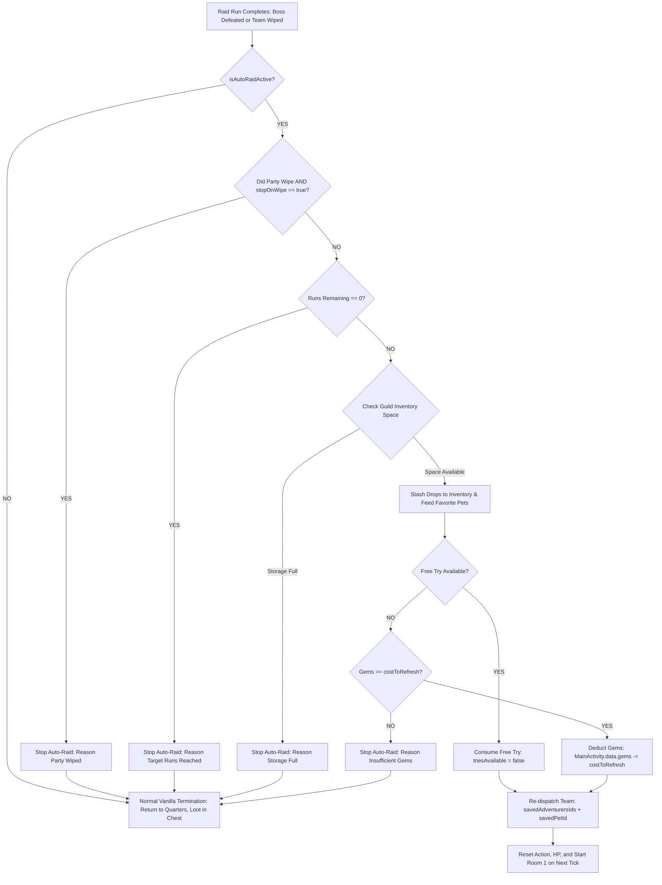

# Implementation Plan: Auto-Raid System

> **Status**: Planned  
> **Category**: Combat / Raids  
> **Target Files**:
> - `app/src/main/kotlin/it/paranoidsquirrels/idleguildmaster/storage/data/places/Area.kt`
> - `app/src/main/kotlin/it/paranoidsquirrels/idleguildmaster/storage/data/DataDeserializer.kt`
> - `app/src/main/kotlin/it/paranoidsquirrels/idleguildmaster/ui/raids/RaidsFragment.kt`
> - `app/src/main/kotlin/it/paranoidsquirrels/idleguildmaster/ui/dialogs/DialogSendTeam.kt`
> - `app/src/main/kotlin/it/paranoidsquirrels/idleguildmaster/ui/dialogs/DialogDungeonDetail.kt`
> - `app/src/main/kotlin/it/paranoidsquirrels/idleguildmaster/ui/dialogs/DialogAutoRaidConfig.kt` [NEW]
> - `app/src/main/res/layout/dialog_send_team.xml`
> - `app/src/main/res/layout/dialog_dungeon_detail.xml`
> - `app/src/main/res/layout/dialog_auto_raid_config.xml` [NEW]
> - `app/src/main/res/layout/layout_dungeon.xml`
> - `app/src/main/res/values/strings.xml`

---

## 1. Goal & Problem Overview

### 1.1 The Problem in Vanilla
In *Idle Guild Master*, farming normal raids (e.g. *The Tower*, *The Lost Expedition*, *The Cultist Rebels*, *Sleeping Planet*, *Kaunis*) is an extremely repetitive, manual ordeal:
1. Tap raid $\rightarrow$ buy 1 try for 15 or 30 gems (`DialogRefillRaidTry`).
2. Tap raid again $\rightarrow$ open `DialogSendTeam`.
3. Select or confirm heroes $\rightarrow$ click Send.
4. Wait 1–3 minutes for the raid to finish.
5. Team wipes or beats boss $\rightarrow$ team is recalled to Quarters.
6. Player must tap chest to claim loot, tap raid to buy try again, tap raid again to dispatch team again.
7. Repeating this 20–50 times requires constant phone monitoring and hundreds of repetitive taps.

### 1.2 The Proposed Solution: Auto-Raid System
An automated raid dispatch and refill loop powered by gems:
- Players configure Auto-Raid with a desired run count (e.g. 5, 10, 25, or Unlimited until out of gems) and safety stop conditions (stop on wipe, stop on full storage).
- When a raid run concludes, the game automatically:
  1. Stashes earned loot into inventory and auto-feeds favorite pets (protecting against loot-cap overflow).
  2. Evaluates stop conditions.
  3. Automatically deducts `costToRefresh()` gems from the guild treasury (or consumes a free daily try if available).
  4. Immediately re-dispatches the saved team (`savedAdventurersIds` + `savedPetId`).
  5. Continues cycling seamlessly in foreground **and** during offline idle progress.

---

## 2. Supported Raid Targets

Auto-Raid operates exclusively on repeatable normal raids:
- **Eligible Areas (`getAreaType() == 1` and `canRefillWithGems() == true`)**:
  - *The Tower* (15 gems/run)
  - *Sleeping Planet* (15 gems/run)
  - *Kaunis* (15 gems/run)
  - *The Slime Pond* (30 gems/run)
  - *The Lost Expedition* (30 gems/run)
  - *The Cultist Rebels* (30 gems/run)
  - *Celestial Mothership* (30 gems/run)
  - *Ancient Grave Digging* (30 gems/run)
  - *The Sanguine Crucible* (Scarlet Raid Boss, 30 gems/run)
- **Excluded**:
  - Dungeons (`getAreaType() == 0`): Already run infinitely for free.
  - Epic Raids (`getAreaType() == 2`): Weekly one-time progression encounters.
  - Guild Activities (`canRefillWithGems() == false`): Limited daily/weekly guild tickets, no gem refills allowed.

---

## 3. Auto-Raid Lifecycle & Control Flow



---

## 4. Detailed Component Design

### 4.1 State & Persistence in `Area.kt`

Add Auto-Raid fields directly to the base `Area` class:
```kotlin
// Auto-Raid State
var isAutoRaidActive: Boolean = false
var autoRaidRunsRemaining: Int = -1      // -1 = Unlimited (until out of gems), or positive count
var autoRaidRunsCompleted: Int = 0       // Session counter
var autoRaidStopOnWipe: Boolean = true   // Safety: stop if team dies to prevent wasting gems
var autoRaidGemsSpent: Int = 0           // Session gem expense tracking
```

#### Serialization (`DataDeserializer.kt`)
Persist these fields in `getArea(...)` so Auto-Raid continues uninterrupted across app restarts and saves:
```kotlin
if (asJsonObject.has("isAutoRaidActive")) {
    tNewInstance.isAutoRaidActive = asJsonObject.get("isAutoRaidActive").asBoolean
}
if (asJsonObject.has("autoRaidRunsRemaining")) {
    tNewInstance.autoRaidRunsRemaining = asJsonObject.get("autoRaidRunsRemaining").asInt
}
if (asJsonObject.has("autoRaidRunsCompleted")) {
    tNewInstance.autoRaidRunsCompleted = asJsonObject.get("autoRaidRunsCompleted").asInt
}
if (asJsonObject.has("autoRaidStopOnWipe")) {
    tNewInstance.autoRaidStopOnWipe = asJsonObject.get("autoRaidStopOnWipe").asBoolean
}
```

---

### 4.2 Combat Loop Hook (`Area.kt`)

In `Area.tick()` where `terminationRequested` is processed:
```kotlin
if (this.terminationRequested) {
    if (this.isAutoRaidActive && handleAutoRaidCycle()) {
        return // Next run successfully dispatched
    }
    terminate()
    return
}
```

#### Auto-Raid Cycle Method (`Area.handleAutoRaidCycle()`):
```kotlin
private fun handleAutoRaidCycle(): Boolean {
    if (!isAutoRaidActive || getAreaType() != 1 || savedAdventurersIds.isEmpty()) {
        isAutoRaidActive = false
        return false
    }

    val wiped = adventurersAlive() == 0

    // 1. Stop on Wipe Check
    if (wiped && autoRaidStopOnWipe) {
        stopAutoRaid(R.string.auto_raid_stopped_wipe)
        return false
    }

    // 2. Decrement Run Counter
    if (autoRaidRunsRemaining > 0) {
        autoRaidRunsRemaining--
        if (autoRaidRunsRemaining == 0) {
            stopAutoRaid(R.string.auto_raid_stopped_completed)
            return false
        }
    }

    // 3. Stash Loot to Prevent Overflowing Area Loot Cap (2,000 cap)
    val favPets = MainActivity.data.pets.filter { it.favourite }
    val remainingSpace = Utils.remainingInventorySpaceAfterCollecting(favPets.isNotEmpty(), *this.drops.toTypedArray())
    if (remainingSpace < 0) {
        stopAutoRaid(R.string.auto_raid_stopped_storage_full)
        return false
    }
    stashDropsDirectly()

    // 4. Verify & Deduct Gems
    if (!this.triesAvailable) {
        val cost = costToRefresh()
        if (MainActivity.data.gems < cost) {
            stopAutoRaid(R.string.auto_raid_stopped_no_gems)
            return false
        }
        MainActivity.data.gems -= cost
        autoRaidGemsSpent += cost
        (MainActivity.raidsFragment?.activity as? MainActivity)?.refreshGems()
    } else {
        this.triesAvailable = false
    }

    // 5. Re-dispatch Team
    autoRaidRunsCompleted++
    Logger.log(this, 105, autoRaidRunsCompleted) // Log auto-dispatch in raid history

    this.adventurersExploringIds = CopyOnWriteArrayList(this.savedAdventurersIds)
    this.petExploringId = this.savedPetId
    this.terminationRequested = false
    this.progress = 0
    this.action = null // Triggers fresh Action(0) and resetAdventurers(true) on next tick

    setupAdventurers(MainActivity.data.adventurers, MainActivity.data.pets)
    refreshActionDisplayed()
    refreshAdventurers()
    refreshTries()
    return true
}

private fun stopAutoRaid(reasonResId: Int) {
    this.isAutoRaidActive = false
    Logger.log(this, 106, reasonResId)
    (MainActivity.raidsFragment?.activity as? MainActivity)?.runOnUiThread {
        MainActivity.raidsFragment?.refresh()
    }
}
```

---

### 4.3 Stashing Drops Directly (`Area.stashDropsDirectly`)

To ensure loot doesn't pile up in `area.drops` over 20+ runs and risk hitting the area loot cap:
```kotlin
fun stashDropsDirectly() {
    if (this.drops.isEmpty()) return

    val favPets = MainActivity.data.pets.filter { it.favourite }
    var feedPower = 0

    for (item in this.drops) {
        if (favPets.isEmpty() || item !is Food) {
            Utils.collectItem(item, MainActivity.data.items)
        } else {
            feedPower += item.getFeedPower() * item.getStack()
        }
    }

    if (favPets.isNotEmpty() && feedPower > 0) {
        val effectiveFeedPower = Utils.effectiveAutoFeedPower(feedPower)
        val perPet = effectiveFeedPower / favPets.size
        for (pet in favPets) {
            pet.feed(perPet)
        }
    }

    this.drops.clear()
    refreshLoot()
    MainActivity.headquartersFragment?.refresh()
}
```

---

### 4.4 User Interface Integration

#### A. Direct Configuration Dialog: `DialogAutoRaidConfig.kt` [NEW]
A dedicated dialog opened when tapping **"AUTO-RAID"** in `DialogSendTeam` or on the raid card:
- **Title**: `Auto-Raid: [Raid Name]`
- **Information Panel**:
  - Current Gems: `💎 [gems]`
  - Cost per Run: `💎 [costToRefresh]`
  - Max Affordable Runs: `[gems / cost]`
- **Run Limit Selector**:
  - Preset Chips: `[5 Runs]`, `[10 Runs]`, `[25 Runs]`, `[Unlimited / All Gems]`
  - Stepper buttons (`-` / `+`) to fine-tune exact count.
- **Safety Toggles**:
  - `Stop on Team Wipe`: YES / NO (default YES).
  - `Stop on Full Storage`: Always ON (protected).
- **Buttons**:
  - `Cancel`
  - `Start Auto-Raid` (Highlighted in Brass)

#### B. `DialogSendTeam.kt` Integration
- Add an `AUTO-RAID` button next to `send`:
  - When `area.getAreaType() == 1`, `b.autoRaid.visibility = View.VISIBLE`.
  - Tapping `autoRaid` checks if at least 1 adventurer is selected; then opens `DialogAutoRaidConfig` with the chosen team.

#### C. `DialogDungeonDetail.kt` Integration
- When viewing an active raid run in `DialogDungeonDetail`:
  - If Auto-Raid is ON: Displays `[AUTO: ON (Runs left: X)]` in brass. Tapping it toggles Auto-Raid OFF.
  - If Auto-Raid is OFF: Displays `[AUTO: OFF]`. Tapping it opens `DialogAutoRaidConfig` to enable Auto-Raid for subsequent runs without aborting the current battle!

#### D. Raid Card Visuals (`RaidsFragment` / `layout_dungeon.xml`)
- When `area.isAutoRaidActive`:
  - A glowing brass badge `[AUTO]` displays in top-right next to `raid_try_available`.
  - Action progress text shows: `Auto-Raid #X ([Y] left)`.

---

### 4.5 Streamlined Refill Flow (Bypassing Double-Tapping)

In vanilla, tapping an empty raid without tries opens `DialogRefillRaidTry`, which only buys 1 try and closes, forcing the player to tap the raid a second time to reach `DialogSendTeam`.

With Auto-Raid:
- In `UIUtils.clickArea`:
  If `!area.triesAvailable && area.canRefillWithGems()`:
  - If `area.savedAdventurersIds.isNotEmpty()`:
    - Add an **"Auto-Raid"** option directly in `DialogRefillRaidTry`, or allow opening `DialogSendTeam` directly where the player can see both "Send (X 💎)" and "Auto-Raid".
  - This eliminates the awkward double-dialog tap flow!

---

## 5. Offline & Background Simulation

Because `MainActivity.kt` executes:
```kotlin
for (area in list) {
    area.tick()
}
```
for every offline idle second up to the player's idle cap:
- **Offline Auto-Raids work 100% out of the box!**
- A player can queue 20 runs, exit the app, and offline progression ticks the encounters, defeats bosses, deducts gems, auto-stashes loot, and terminates cleanly when the 20 runs are completed.
- Upon re-opening the app, the player sees:
  - Total runs completed in combat logs.
  - All rare items, equipment, and materials safely stashed in inventory.
  - Accurate gem deduction.
  - Hero levels and EXP updated.

---

## 6. Strings & Localization (`strings.xml`)

```xml
<string name="auto_raid_title">Auto-Raid</string>
<string name="auto_raid_start">START AUTO-RAID</string>
<string name="auto_raid_stop">STOP AUTO-RAID</string>
<string name="auto_raid_badge">AUTO</string>
<string name="auto_raid_runs_remaining">Auto-Raid: %d runs left</string>
<string name="auto_raid_runs_unlimited">Auto-Raid: Unlimited</string>
<string name="auto_raid_cost_per_run">Cost per run: %d gems</string>
<string name="auto_raid_affordable_runs">Max affordable: %d runs</string>
<string name="auto_raid_stop_on_wipe">Stop on party wipe:</string>
<string name="auto_raid_stopped_wipe">Auto-Raid stopped: Team was defeated.</string>
<string name="auto_raid_stopped_completed">Auto-Raid completed: All target runs finished.</string>
<string name="auto_raid_stopped_no_gems">Auto-Raid stopped: Insufficient gems.</string>
<string name="auto_raid_stopped_storage_full">Auto-Raid stopped: Guild storage is full.</string>
```

---

## 7. Verification Plan

### 7.1 Automated Unit Tests
- `AutoRaidTest.kt`:
  - Test run counter decrements correctly.
  - Test gems are deducted exactly by `costToRefresh()` per run.
  - Test free daily try is consumed first before gems.
  - Test wipe with `autoRaidStopOnWipe = true` halts auto-raid and does not spend subsequent gems.
  - Test storage full condition halts auto-raid immediately without item loss.
  - Test `stashDropsDirectly` correctly deposits items and feeds favorite pets.

### 7.2 Manual Playtest
1. **Starting Auto-Raid**: Open *The Tower* $\rightarrow$ Select team $\rightarrow$ Tap "AUTO-RAID" $\rightarrow$ Select 3 runs $\rightarrow$ Start.
2. **Foreground Execution**: Watch Run 1 complete $\rightarrow$ Verify gems decrease by 15 $\rightarrow$ Verify Run 2 dispatches automatically with same team $\rightarrow$ Run 3 completes $\rightarrow$ Auto-Raid stops.
3. **Loot Verification**: Verify all drops from the 3 runs are present in guild inventory.
4. **Mid-Fight Toggle**: Start Auto-Raid $\rightarrow$ Open `DialogDungeonDetail` $\rightarrow$ Tap "STOP AUTO" $\rightarrow$ Verify current run finishes normally and does not re-dispatch.
5. **Offline Test**: Queue 5 runs on *The Cultist Rebels* $\rightarrow$ Close app $\rightarrow$ Wait 10 minutes $\rightarrow$ Re-open app $\rightarrow$ Verify all 5 runs simulated, gems deducted, and loot stashed.
