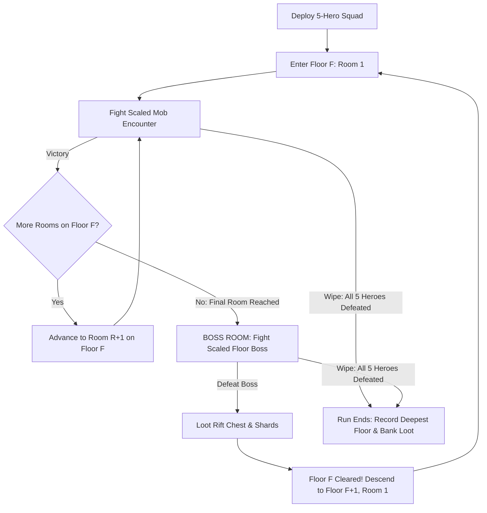
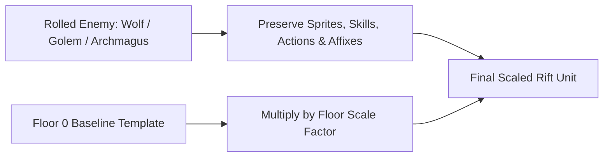

# Implementation Plan: Dimensional Rift (Endless Delve Mode)

## 1. Goal Description

Introduce an endless dungeon progression mode—**The Dimensional Rift**—where players assemble and dispatch an elite 5-hero squad to delve as deep as possible through infinitely ascending floors.

### Core Philosophy
1. **Uncapped Floor Progression**: The Rift has no floor limit or reset loop; floors scale upward indefinitely ($1, 2, 3, \dots, \infty$).
2. **Floor & Room Structure**:
   - Each Floor contains a randomized number of rooms ($\text{randomInt}(3, 5)$).
   - Rooms $1$ to $\text{totalRooms} - 1$ are scaled monster encounters.
   - **The final room of every floor is ALWAYS a Boss Room.**
   - The party **only descends to the next floor upon defeating the Floor Boss**.
3. **Floor 0 Baseline Stat Normalization**:
   - Enemy and boss stats are completely decoupled from their hardcoded vanilla values.
   - Every monster's stats are calculated from a **Floor 0 Baseline Stat Template** multiplied by a dynamic floor scaling factor.
   - Early-game enemies (e.g. D1 Slimes, Wolves) are scaled up to be just as lethal as D9/D11 enemies at any given floor, while endgame enemies rolled on low floors have their stats properly tempered to remain beatable.
   - Preserves all unique enemy skill sets, sprites, and animations.
4. **Guild Benchmark & High Score**:
   - Tracks each player's **Deepest Floor Cleared** (`maxDimensionalRiftFloor`).
   - Earns exclusive **Rift Shards** used for endgame rewards, consumables, and cosmetics.

---

## 2. Floor & Room Progression Flow



### 2.1 Squad State & Room Persistence
- **Party Size**: **5 Adventurers**.
- **Attrition Across Rooms**: Adventurer HP, shields, and status conditions carry over from room to room within the same floor.
- **Boss Victory Recovery**: Defeating the Floor Boss clears the floor, grants an Abyssal Chest, and restores $35\%$ Max HP to all surviving heroes before dropping them into Floor $F + 1$.
- **Wipe Handling**: When all 5 heroes fall at any point:
  - The delve concludes immediately.
  - If `floor - 1 > maxDimensionalRiftFloor`, the record is updated.
  - All accumulated loot, gold, and **Rift Shards** are safely deposited into guild inventory.
  - Adventurers return safely to Quarters (standard IGM recovery, no permadeath).

---

## 3. Floor 0 Baseline Stat Normalization System

### 3.1 The Level-Decoupling Principle
Instead of taking vanilla hardcoded stats (where a D1 Wolf has 30 HP and a D11 Archmagus Valthex has 20,000 HP), every enemy spawned inside the Dimensional Rift derives its raw numbers from a **Floor 0 Template**:



### 3.2 Floor 0 Baseline Templates
- **Standard Mob Baseline (Floor 0)**:
  - `HP`: 100
  - `ATK`: 12 – 18
  - `DEF` / `M.DEF`: 5 / 5
  - `CON` / `DEX` / `INT`: 10
- **Floor Boss Baseline (Floor 0)**:
  - `HP`: 450 ($4.5\times$ mob)
  - `ATK`: 25 – 35
  - `DEF` / `M.DEF`: 15 / 15
  - `CON` / `DEX` / `INT`: 25

### 3.3 Archetype Stat Ratios (Flavor Polish)
To preserve monster identity while keeping overall power normalized:
- **Tanks** (e.g. `ObsidianGolem`, `TrollWarrior`, `GiantTortoise`): $+30\%$ HP & DEF, $-20\%$ ATK.
- **Assassins/DPS** (e.g. `Wolf`, `ArcaneAssassin`, `VampireBat`): $-20\%$ HP, $+30\%$ ATK, higher initiative.
- **Casters** (e.g. `WizardOfLarox`, `IceElemental`, `ImperialMage`): $-10\%$ HP, $+25\%$ Magic ATK, active spell rotation.
- **Balanced** (e.g. `Centaur`, `Slime`, `Crusader`): $1.0\times$ all baseline stats.

---

## 4. The Floor Scaling Multiplier

For any Floor $F \ge 1$:
$$\text{Multiplier}(F) = (1.0 + F \times 0.15) \times 1.02^{\max(0, F - 20)}$$

$$\text{EnemyStat}(F) = \text{BaseStat}_{\text{Floor 0}} \times \text{Multiplier}(F)$$

### Scaling Table Across Depth:

| Floor | Multiplier | Standard Mob Stats | Floor Boss Stats | Challenge Bracket |
| :---: | :---: | :--- | :--- | :--- |
| **Floor 1** | $1.15\times$ | **115 HP** \| 14–20 ATK \| 6 DEF | **515 HP** \| 29–40 ATK \| 17 DEF | Level 15–20 Party |
| **Floor 10** | $2.50\times$ | **250 HP** \| 30–45 ATK \| 12 DEF | **1,125 HP** \| 62–88 ATK \| 38 DEF | Level 30–40 Party |
| **Floor 25** | $5.30\times$ | **530 HP** \| 65–95 ATK \| 26 DEF | **2,385 HP** \| 130–185 ATK \| 80 DEF | Tier 6–7 Endgame |
| **Floor 50** | $15.5\times$ | **1,550 HP** \| 185–280 ATK \| 78 DEF | **6,975 HP** \| 385–540 ATK \| 230 DEF | Ascended T8 Party |
| **Floor 75** | $36.0\times$ | **3,600 HP** \| 430–650 ATK \| 180 DEF | **16,200 HP** \| 900–1,260 ATK \| 540 DEF | Transcended Mastery |
| **Floor 100** | $78.0\times$ | **7,800 HP** \| 930–1,400 ATK \| 390 DEF | **35,100 HP** \| 1,950–2,730 ATK \| 1,170 DEF | Extreme Limit |
| **Floor 150+** | $300\times+$ | **30,000+ HP** \| 3,600+ ATK | **135,000+ HP** \| 7,500+ ATK | Inevitable Wipe Wall |

---

## 5. Waystone Checkpoints (Every 20 Floors)

To give players the option between farming resources or pushing their limits:
- Clearing Floor 20 unlocks **Waystone 2** (Floor 21).
- Clearing Floor 40 unlocks **Waystone 3** (Floor 41).
- Clearing Floor 60 unlocks **Waystone 4** (Floor 61).
- Clearing Floor 80 unlocks **Waystone 5** (Floor 81).
- Clearing Floor 100 unlocks **Waystone 6** (Floor 101).

### Deployment Options:
1. **Full Delve (Floor 1)**: Accumulates all Rift Shards, loot chests, and gold from the beginning.
2. **Waystone Leap**: Deploys directly at the highest unlocked Waystone to test squad limits against high-floor bosses immediately.

---

## 6. Rewards & Currency

### 6.1 Rift Shards (`RiftShard`)
- Awarded for slaying Floor Bosses:
  $$\text{ShardsPerBoss} = 2 + \lfloor F / 10 \rfloor \times 2$$
- Spent in the **Rift Treasury** for:
  - Exclusive weapon/armor cosmetics.
  - Rare crafting materials and high-tier potion ingredients.
  - Evo-22 and Evo-23 Vials.
  - Transcendent catalysts.

### 6.2 Milestone First-Clear Rewards
One-time rewards granted when clearing key boss floors:
- **Floor 10**: 100 Gems + 10,000 Gold
- **Floor 25**: 250 Gems + 1× Potion of Rejuvenation
- **Floor 50**: 500 Gems + 1× Evo-22 Vial
- **Floor 75**: 750 Gems + 1× Evo-23 Vial
- **Floor 100**: 1,500 Gems + Exclusive Title / Banner: *"Dimensional Conqueror"*

---

## 7. Technical Implementation Details

### 7.1 Entity Wrapper: `DimensionalRiftEnemy.kt`
Modeled after [`EliteEnemy.kt`](file:///c:/Repositories/IGM-Modded/app/src/main/kotlin/it/paranoidsquirrels/idleguildmaster/storage/data/entities/enemies/EliteEnemy.kt):
```kotlin
class DimensionalRiftEnemy private constructor(
    val base: Enemy,
    val floor: Int,
    val isBoss: Boolean
) : Enemy() {
    companion object {
        fun create(base: Enemy, floor: Int, isBoss: Boolean): DimensionalRiftEnemy {
            val riftEnemy = DimensionalRiftEnemy(base, floor, isBoss)
            riftEnemy.applyFloorStats(floor, isBoss)
            return riftEnemy
        }
    }

    private fun applyFloorStats(floor: Int, isBoss: Boolean) {
        val multiplier = DimensionalRiftScaling.getMultiplier(floor)
        val archetype = DimensionalRiftScaling.getArchetype(base)
        
        val baseHp = (if (isBoss) 450 else 100) * archetype.hpRatio
        val baseAtkMin = (if (isBoss) 25 else 12) * archetype.atkRatio
        val baseAtkMax = (if (isBoss) 35 else 18) * archetype.atkRatio
        val baseDef = (if (isBoss) 15 else 5) * archetype.defRatio

        baseMaxHp = (baseHp * multiplier).toInt()
        currentHp = baseMaxHp
        baseDefense = (baseDef * multiplier).toInt()
        baseMagicDefense = (baseDef * multiplier).toInt()
        baseConstitution = (10 * multiplier).toInt()
        baseDexterity = (10 * multiplier).toInt()
        baseIntelligence = (10 * multiplier).toInt()
        
        minDmg = (baseAtkMin * multiplier).toInt()
        maxDmg = (baseAtkMax * multiplier).toInt()

        // Copy skills, animations, and visuals
        imageId = base.imageId
        idName = base.idName
        idDescription = base.idDescription
        passiveSkill = base.passiveSkill
        activeSkill = base.activeSkill
        initiative = base.initiative
    }
}
```

### 7.2 Area Controller: `DimensionalRiftArea.kt`
- **Location**: `app/src/main/kotlin/it/paranoidsquirrels/idleguildmaster/storage/data/places/raids/DimensionalRiftArea.kt`
- Subclasses `Area()`:
  - `adventurersNumber(): Int = 5`
  - `getAreaType(): Int = Area.TYPE_EPIC_RAID`
  - Internal state: `currentFloor: Int`, `currentRoom: Int`, `totalRoomsInFloor: Int`.
  - In `searchRoom()`:
    - If `currentRoom < totalRoomsInFloor`: rolls 1–3 scaled `DimensionalRiftEnemy` mobs.
    - If `currentRoom == totalRoomsInFloor`: rolls 1 scaled `DimensionalRiftEnemy` boss!
    - Defeating the boss clears the floor, grants rewards, heals the party $35\%$, increments `currentFloor++`, and rolls a new `totalRoomsInFloor = random(3..5)`.

### 7.3 Data Persistence in `Data.kt`
- `maxDimensionalRiftFloor: Int = 0`
- `unlockedDimensionalRiftWaystone: Int = 1`
- `dimensionalRiftShards: Int = 0`

---

## 8. Verification & Test Plan

1. **Stat Normalization Test**:
   - Instantiate a `DimensionalRiftEnemy` wrapping a D1 `Wolf` on Floor 50.
   - Verify its HP and damage match Floor 50 standards (~1,550 HP), and not the vanilla 30 HP.
2. **Floor & Boss Room Progression**:
   - Mock room victories through a 4-room floor; verify Floor 1 Room 4 is a boss room.
   - Defeating Room 4 increments `currentFloor` to 2 and resets room to 1.
3. **Wipe & High Score Recording**:
   - Force all 5 heroes to die on Floor 18; verify run terminates cleanly and `maxDimensionalRiftFloor` updates to 17.
4. **Waystone Unlock Verification**:
   - Verify clearing Floor 20 unlocks Waystone 2 (Floor 21) in player save data.
5. **Full Test Suite**:
   - Run `./gradlew.bat testDebugUnitTest` to ensure zero regressions across existing game mechanics.
