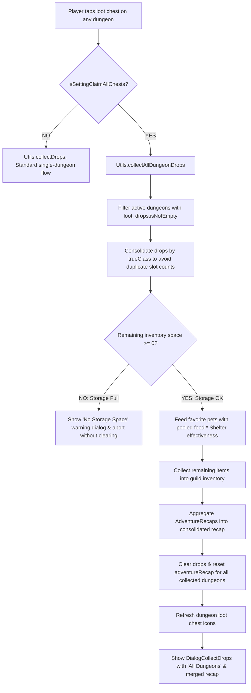

# Implementation Plan: "Claim All Chests" Settings Toggle

> **Status**: Planned (Approach A Selected)  
> **Category**: Guild / Quality of Life  
> **Target Files**:
> - `app/src/main/kotlin/it/paranoidsquirrels/idleguildmaster/storage/data/Data.kt`
> - `app/src/main/kotlin/it/paranoidsquirrels/idleguildmaster/storage/data/DataDeserializer.kt`
> - `app/src/main/res/layout/dialog_settings.xml`
> - `app/src/main/kotlin/it/paranoidsquirrels/idleguildmaster/ui/dialogs/DialogSettings.kt`
> - `app/src/main/kotlin/it/paranoidsquirrels/idleguildmaster/Utils.kt`
> - `app/src/main/kotlin/it/paranoidsquirrels/idleguildmaster/ui/dungeons/DungeonsFragment.kt`
> - `app/src/main/res/values/strings.xml`

---

## 1. Goal Description

Add a Quality-of-Life toggle setting in [DialogSettings](file:///c:/Repositories/IGM-Modded/app/src/main/kotlin/it/paranoidsquirrels/idleguildmaster/ui/dialogs/DialogSettings.kt) allowing players to enable **"Claim all chests"** (`isSettingClaimAllChests`).

- **Toggle OFF (Default / Vanilla behavior)**: Tapping a dungeon's chest collects loot and opens the report solely for that specific dungeon.
- **Toggle ON**: Tapping the loot chest of **any** dungeon with loot sweeps and collects all pending chests across all active dungeons in a single tap.

---

## 2. Adventure Report Design: Approach A (Consolidated Guild Expedition Report)

When claiming a single dungeon, [DialogCollectDrops](file:///c:/Repositories/IGM-Modded/app/src/main/kotlin/it/paranoidsquirrels/idleguildmaster/ui/dialogs/DialogCollectDrops.kt) includes a **"Report"** button leading to [DialogReport](file:///c:/Repositories/IGM-Modded/app/src/main/kotlin/it/paranoidsquirrels/idleguildmaster/ui/dialogs/DialogReport.kt).

With **Approach A**, batch-claiming merges all active dungeon recaps into a single unified [AdventureRecap](file:///c:/Repositories/IGM-Modded/app/src/main/kotlin/it/paranoidsquirrels/idleguildmaster/storage/data/places/AdventureRecap.kt):

| Metric | Aggregation Method | In-Game Meaning |
| :--- | :--- | :--- |
| **Source / Title** | `R.string.all_dungeons` ("All Dungeons") | Header displays: `Loot - All Dungeons` and `Report - All Dungeons`. |
| **Duration** | `maxOfOrNull { it.secondsPassed } ?: 0` | Represents the elapsed duration of the idle session. |
| **Areas Cleared** | `sumOf { it.areasCleared }` | Total number of rooms cleared across all active dungeon parties. |
| **Team Wipes** | `sumOf { it.wiped }` | Total number of party wipeouts across all dungeons. |
| **EXP Earned** | `sumOf { it.expEarned }` | Total raw experience gained by all heroes across all dungeons. |
| **EXP Lost** | `sumOf { it.expLost }` | Total experience lost from wipes across all dungeons. |
| **EXP / Hour** | `((expEarned - expLost) * 3600.0) / maxSeconds` | Guild-wide net XP generation rate per hour. |
| **Enemies Slain** | Grouped by `EnemyCounter.enemy` & summed | Combines identical monster counters (e.g. 20 Goblins in D1 + 15 Goblins in D2 = 35 Goblins). |

> [!TIP]
> This transforms "Claim All" into a comprehensive guild overview after an idle session, giving players immediate feedback on their entire roster's productivity.

---

## 3. Technical Architecture & Control Flow



---

## 4. Detailed Component Changes

### 4.1 Data & Serialization
#### [MODIFY] [`Data.kt`](file:///c:/Repositories/IGM-Modded/app/src/main/kotlin/it/paranoidsquirrels/idleguildmaster/storage/data/Data.kt)
Add the field to the settings section:
```kotlin
@SerializedName("settingClaimAllChests")
var isSettingClaimAllChests: Boolean = false
```
In `Data.init`:
```kotlin
isSettingClaimAllChests = false
```

#### [MODIFY] [`DataDeserializer.kt`](file:///c:/Repositories/IGM-Modded/app/src/main/kotlin/it/paranoidsquirrels/idleguildmaster/storage/data/DataDeserializer.kt)
Safely parse with fallback:
```kotlin
this.data.isSettingClaimAllChests = asJsonObject.has("settingClaimAllChests") && asJsonObject.get("settingClaimAllChests").asBoolean
```

---

### 4.2 Settings UI
#### [MODIFY] [`dialog_settings.xml`](file:///c:/Repositories/IGM-Modded/app/src/main/res/layout/dialog_settings.xml)
`dialog_settings.xml` positions setting rows using fixed `64.0dip` vertical increments (`@id/separator` anchor).
- Current last row: `value_colorblind_mode` at `marginTop="512.0dip"`.
- Add new row at `marginTop="576.0dip"`:
```xml
<TextView
    android:gravity="right"
    android:id="@id/description_claim_all_chests"
    android:layout_width="0.0dip"
    android:layout_height="wrap_content"
    android:text="@string/drawer_settings_claim_all_chests"
    app:layout_constraintBottom_toBottomOf="@id/value_claim_all_chests"
    app:layout_constraintEnd_toStartOf="@id/separator"
    app:layout_constraintStart_toStartOf="parent"
    app:layout_constraintTop_toTopOf="@id/value_claim_all_chests" />

<TextView
    android:textStyle="bold"
    android:gravity="center"
    android:id="@id/value_claim_all_chests"
    android:background="@drawable/object_border_brass"
    android:padding="12.0dip"
    android:layout_width="0.0dip"
    android:layout_height="wrap_content"
    android:layout_marginTop="576.0dip"
    android:layout_marginStart="16.0dip"
    app:layout_constraintEnd_toEndOf="parent"
    app:layout_constraintStart_toEndOf="@id/separator"
    app:layout_constraintTop_toTopOf="parent" />
```
- Update `save` button constraint:
```xml
app:layout_constraintTop_toBottomOf="@id/value_claim_all_chests"
```

#### [MODIFY] [`DialogSettings.kt`](file:///c:/Repositories/IGM-Modded/app/src/main/kotlin/it/paranoidsquirrels/idleguildmaster/ui/dialogs/DialogSettings.kt)
- Add property:
  ```kotlin
  private var claimAllChests: Boolean = false
  ```
- In `initialize`:
  ```kotlin
  claimAllChests = MainActivity.data.isSettingClaimAllChests
  ```
- In `refreshValues`:
  ```kotlin
  b.valueClaimAllChests.setText(if (claimAllChests) R.string.yes else R.string.no)
  ```
- In `attachListeners`:
  ```kotlin
  b.valueClaimAllChests.setOnClickListener {
      claimAllChests = !claimAllChests
      refreshValues()
  }
  ```
- In `b.save.setOnClickListener`:
  ```kotlin
  MainActivity.data.isSettingClaimAllChests = claimAllChests
  ```

---

### 4.3 Batch Collection Method
#### [MODIFY] [`Utils.kt`](file:///c:/Repositories/IGM-Modded/app/src/main/kotlin/it/paranoidsquirrels/idleguildmaster/Utils.kt)
Implement `@JvmStatic fun collectAllDungeonDrops(fragment: Fragment)`:
```kotlin
@JvmStatic
fun collectAllDungeonDrops(fragment: Fragment) {
    val activeDungeons = compileDungeonList().filter { it.drops.isNotEmpty() }
    if (activeDungeons.isEmpty()) return

    // 1. Consolidate drop stacks across all dungeons to accurately calculate inventory slot requirement
    val consolidatedDrops = ArrayList<Item>()
    for (area in activeDungeons) {
        for (item in area.drops) {
            val existing = consolidatedDrops.find { it.getTrueClass() == item.getTrueClass() }
            if (existing != null) {
                existing.setStack(existing.getStack() + item.getStack())
            } else {
                val newItem = Item.getInstance(item.getTrueClass() ?: "", item.getStack()) ?: item
                consolidatedDrops.add(newItem)
            }
        }
    }

    val favPets = MainActivity.data.pets.filter { it.favourite }
    val remainingSpace = remainingInventorySpaceAfterCollecting(favPets.isNotEmpty(), *consolidatedDrops.toTypedArray())

    // 2. Prevent collection if inventory would overflow
    if (remainingSpace < 0) {
        if (MainActivity.shownDialogFullStorage != null) return
        val context = fragment.context ?: return
        val dialog = UIUtils.getInfoDialog(
            context,
            R.string.no_storage_space_title,
            String.format(fragment.getString(R.string.no_storage_space_body_loot), -remainingSpace),
            false
        )
        MainActivity.shownDialogFullStorage = dialog
        dialog.setOnDismissListener { MainActivity.shownDialogFullStorage = null }
        dialog.show()
        return
    }

    // 3. Pet auto-feeding across pooled food
    var feedPower = 0
    for (item in consolidatedDrops) {
        if (favPets.isEmpty() || item !is Food) {
            collectItem(item, MainActivity.data.items)
        } else {
            feedPower += item.getFeedPower() * item.getStack()
        }
    }
    if (favPets.isNotEmpty() && feedPower > 0) {
        val effectiveFeedPower = effectiveAutoFeedPower(feedPower)
        val perPet = effectiveFeedPower / favPets.size
        for (pet in favPets) {
            pet.feed(perPet)
        }
    }

    // 4. Merge AdventureRecaps (Approach A)
    val mergedRecap = AdventureRecap()
    mergedRecap.secondsPassed = activeDungeons.maxOfOrNull { it.adventureRecap.secondsPassed } ?: 0
    mergedRecap.areasCleared = activeDungeons.sumOf { it.adventureRecap.areasCleared }
    mergedRecap.wiped = activeDungeons.sumOf { it.adventureRecap.wiped }
    mergedRecap.expEarned = activeDungeons.sumOf { it.adventureRecap.expEarned }
    mergedRecap.expLost = activeDungeons.sumOf { it.adventureRecap.expLost }

    for (area in activeDungeons) {
        for (counter in area.adventureRecap.enemiesKilled) {
            val existing = mergedRecap.enemiesKilled.find { it.enemy == counter.enemy }
            if (existing != null) {
                existing.timesSlain += counter.timesSlain
            } else {
                mergedRecap.enemiesKilled.add(EnemyCounter(counter.enemy, counter.timesSlain))
            }
        }

        // Clear dungeon state
        area.adventureRecap = AdventureRecap()
        area.drops.clear()
        area.refreshLoot()
    }

    // 5. Present Consolidated Dialog
    val dialogCollectDrops = DialogCollectDrops()
    dialogCollectDrops.isCancelable = false
    dialogCollectDrops.drops = consolidatedDrops
    dialogCollectDrops.sourceArea = fragment.getString(R.string.all_dungeons)
    dialogCollectDrops.recap = mergedRecap
    dialogCollectDrops.show(fragment.parentFragmentManager, "dialog_collect_all_drops")

    MainActivity.headquartersFragment?.refresh()
}
```

---

### 4.4 Dungeons Fragment Interaction
#### [MODIFY] [`DungeonsFragment.kt`](file:///c:/Repositories/IGM-Modded/app/src/main/kotlin/it/paranoidsquirrels/idleguildmaster/ui/dungeons/DungeonsFragment.kt)
In `attachListeners()` around line 71:
```kotlin
area.getLayout().lootImage.setOnClickListener {
    if (MainActivity.shownDialogCollectDrops == null) {
        if (MainActivity.data.isSettingClaimAllChests) {
            Utils.collectAllDungeonDrops(this)
        } else {
            Utils.collectDrops(this, area)
        }
    }
}
```

---

### 4.5 Strings & Localization
#### [MODIFY] [`res/values/strings.xml`](file:///c:/Repositories/IGM-Modded/app/src/main/res/values/strings.xml)
```xml
<string name="drawer_settings_claim_all_chests">Claim all chests:</string>
<string name="all_dungeons">All Dungeons</string>
```

---

## 5. Verification Plan

### 5.1 Automated Unit Tests (`app/src/test/`)
- Verify `collectAllDungeonDrops` with multiple dummy areas:
  - Total items deposited into inventory equals consolidated drop amounts.
  - Full inventory check accurately prevents state modification.
  - Merged recap accurately aggregates kill counts, areas cleared, wipes, and duration.

### 5.2 Manual Playtest
1. **Setting Toggle**: Open Settings $\rightarrow$ Toggle "Claim all chests:" ON and SAVE. Re-open settings to verify persistence across restarts.
2. **Vanilla Single Mode (Toggle OFF)**: Tap chest on Dungeon A $\rightarrow$ Only Dungeon A is collected; Dungeon B's chest remains visible.
3. **Batch Mode (Toggle ON)**:
   - Run 2+ dungeons until multiple chests are visible.
   - Tap any chest.
   - Verify all dungeon chests disappear simultaneously.
   - Verify Dialog displays consolidated loot under `"Loot - All Dungeons"`.
   - Tap **"Report"**: Verify DialogReport displays `"Report - All Dungeons"`, aggregated duration, cleared rooms, wipes, EXP/hr, and combined enemy kill counts.
