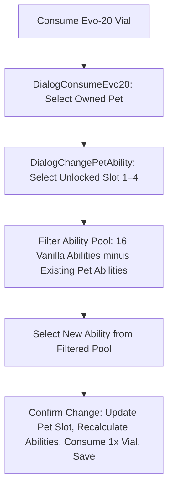
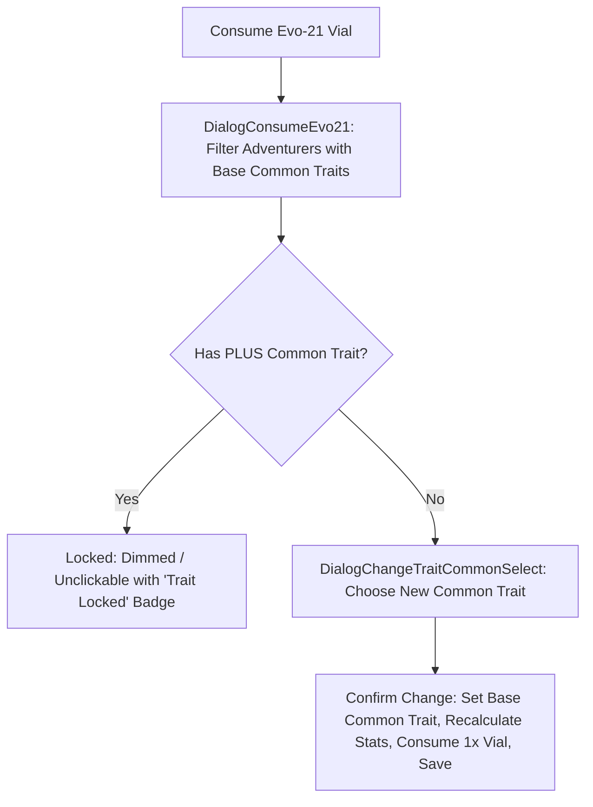
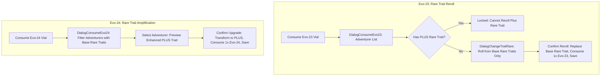

# Implementation Plan: Evolution Vials Expansion (Evo-20, Evo-21, Evo-24)

## 1. Goal Description

Complete and balance the **Evolution Vial Ecosystem** in *Idle Guild Master* by introducing three specialized vials:
1. **Evo-20 Vial (`Evo20Vial`)**: Modifies / rerolls an unlocked **Pet Trait (Ability)**.
2. **Evo-21 Vial (`Evo21Vial`)**: Modifies / rerolls an adventurer's **Basic (Common) Trait** to any of the 7 Common traits.
3. **Evo-24 Vial (`Evo24Vial`)**: Amplifies an adventurer's **Rare Trait into its PLUS form** (`Trait+`).

### Confirmed Visual Assets
The custom PNG sprites have been placed directly in `app/src/main/res/drawable/`:
- [`app/src/main/res/drawable/evo20_vial.png`](file:///c:/Repositories/IGM-Modded/app/src/main/res/drawable/evo20_vial.png) (`R.drawable.evo20_vial`)
- [`app/src/main/res/drawable/evo21_vial.png`](file:///c:/Repositories/IGM-Modded/app/src/main/res/drawable/evo21_vial.png) (`R.drawable.evo21_vial`)
- [`app/src/main/res/drawable/evo24_vial.png`](file:///c:/Repositories/IGM-Modded/app/src/main/res/drawable/evo24_vial.png) (`R.drawable.evo24_vial`)

### Core Design Principles
- **Clean Symmetrical Hierarchy**:
  - **Evo-20**: Pet Trait Modification (Reroll)
  - **Evo-21**: Adventurer Basic Trait Modification (Reroll)
  - **Evo-22**: Adventurer Basic Trait Amplification (Upgrade to `+`)
  - **Evo-23**: Adventurer Rare Trait Modification (Reroll)
  - **Evo-24**: Adventurer Rare Trait Amplification (Upgrade to `+`)
- **Permanence of PLUS Traits ("No Switching" Rule)**:
  - Once any trait is amplified to its enhanced PLUS form (`Trait+`), it is **permanently locked**.
  - **Evo-21 cannot switch a PLUS Common trait** (e.g. `Brute+` or `Bookworm+` cannot be rerolled or replaced).
  - **Evo-23 cannot switch a PLUS Rare trait** (e.g. `Ruthless+`, `Empathetic+`, etc. cannot be rerolled or replaced).
  - Modification vials (`Evo-21`, `Evo-23`) strictly operate on **base traits only**.
- **Strict Separation of Rare & PLUS Pools**:
  - Remove `RUTHLESS_PLUS` from [`DialogChangeTraitRare.kt`](file:///c:/Repositories/IGM-Modded/app/src/main/kotlin/it/paranoidsquirrels/idleguildmaster/ui/dialogs/DialogChangeTraitRare.kt#L49) and any direct reroll mechanics.
  - Rare trait rerolls via Evo-23 can **only yield base rare traits**.
  - A PLUS rare trait can **only be obtained via an Evo-24 Vial**, directly mirroring how Evo-22 is required for basic trait PLUS forms.
- **Strict Vanilla Pet Ability Pool & Duplicate Filtering**:
  - Do **not** include unreleased / expanded pet traits; Evo-20 uses only the **16 vanilla abilities**.
  - Evo-20 **strictly forbids** selecting any ability that the pet already has across any of its slots.

---

## 2. Evolution Vial Suite Comparison

| Vial Item | Target Entity | System | Function | Behavior & Scope | Sprite |
| :--- | :--- | :--- | :--- | :--- | :--- |
| **Evo-20 Vial** | Pet | Pet Abilities | **Modify / Reroll** | Selects any unlocked ability slot (Slot 1–4) and chooses a new ability from the 16 vanilla pet abilities (excluding duplicates already possessed). | `R.drawable.evo20_vial` |
| **Evo-21 Vial** | Adventurer | Basic Traits | **Modify / Reroll** | Replaces current Basic trait with any of the 7 Common traits. **Only available for base Common traits (PLUS Common traits cannot be switched).** | `R.drawable.evo21_vial` |
| **Evo-22 Vial** *(Existing)* | Adventurer | Basic Traits | **Amplify to PLUS** | Upgrades an existing base Common trait into its PLUS form (removes stat penalty, doubles bonus). | `R.drawable.evo22_vial` |
| **Evo-23 Vial** *(Existing)* | Adventurer | Rare Traits | **Modify / Reroll** | Replaces current Rare trait with any of the standard base Rare traits. **Only available for base Rare traits (PLUS Rare traits cannot be switched).** | `R.drawable.evo23_vial` |
| **Evo-24 Vial** | Adventurer | Rare Traits | **Amplify to PLUS** | Upgrades an existing base Rare trait into its enhanced PLUS form (e.g. `Ruthless+`, `Empathetic+`, `Nocturnal+`, `Gifted+`, `Intimidating+`, `Cursed+`). | `R.drawable.evo24_vial` |

---

## 3. Detailed Mechanics & Workflows

### 3.1 Evo-20 Vial: Pet Trait Modification



1. **Entity Target**: All pets owned by the guild (`MainActivity.data.pets`).
2. **Slot Selection**:
   - Only unlocked ability slots are eligible:
     - Slot 1: Unlocked at Level 1 (or default)
     - Slot 2: Unlocked if `pet.level >= 21` (or `pet.abilityNumber >= 2`)
     - Slot 3: Unlocked if `pet.level >= 41` (or `pet.abilityNumber >= 3`)
     - Slot 4: Unlocked if `pet.level >= 61` (or `pet.abilityNumber >= 4`)
   - Locked slots are visually disabled and cannot be targeted.
3. **Vanilla Ability Pool (16 Abilities)**:
   - Evaluated strictly against the 16 vanilla `PetAbility` enum constants (excluding `EMPTY`):
     1. `FIGHTER`
     2. `HEALER`
     3. `DECOY`
     4. `OPPORTUNIST`
     5. `MAGIC`
     6. `SAVAGE`
     7. `BRIGHT`
     8. `EXPERIENCE`
     9. `DROPS`
     10. `COUNTERATTACK`
     11. `LIFESTEAL`
     12. `REGENERATION`
     13. `BARRIER`
     14. `BLOODCRAVE`
     15. `LACERATE`
     16. `SERRATED`
   - **Expanded / unreleased traits are omitted** from this feature until they are implemented in the game.
4. **Duplicate Prevention Rule**:
   - The dialog determines all abilities currently assigned across all 4 slots:
     ```kotlin
     val existingAbilities = setOfNotNull(
         pet.petAbility1,
         pet.petAbility2,
         pet.petAbility3,
         pet.petAbility4
     )
     val availableChoices = PetAbility.values().filter { ability ->
         ability != PetAbility.EMPTY && ability !in existingAbilities
     }
     ```
   - A pet can **never** have duplicate abilities in any of its slots.
5. **Execution**:
   - Replaces the selected slot (`pet.petAbility1..4 = newAbility`).
   - Recalculates pet stats: `pet.configureAbilities()`.
   - Consumes 1× `Evo20Vial` via `Utils.removeItemFromStorage(Item.getInstance("Evo20Vial", 1))`.
   - Saves game state via `FileManager.save(context)`.

---

### 3.2 Evo-21 Vial: Adventurer Basic Trait Modification



1. **Target Pool**: All 7 base Common traits:
   - `BOOKWORM`, `BRUTE`, `FERAL`, `VERSATILE`, `ZEALOUS`, `CUNNING`, `ATHLETIC`.
   - The adventurer's current base trait is excluded from the selection list.
2. **Plus Trait Permanence Rule (Cannot Be Switched)**:
   - Adventurers whose `traitCommon` is already a PLUS trait (`BRUTE_PLUS`, `FERAL_PLUS`, `BOOKWORM_PLUS`, `VERSATILE_PLUS`, `ZEALOUS_PLUS`, `CUNNING_PLUS`, `ATHLETIC_PLUS`) **cannot switch their common trait**.
   - In `DialogConsumeEvo21`, adventurers with a PLUS common trait are visually locked (dimmed opacity, disabled click listener, and badge stating "Trait Locked").
   - Only adventurers possessing a standard, un-amplified base Common trait are eligible.
3. **Execution**:
   - Sets `adventurer.traitCommon = selectedTrait`.
   - Recalculates adventurer base statistics and equipment bonuses.
   - Consumes 1× `Evo21Vial`.
   - Saves game state.

---

### 3.3 Evo-23 & Evo-24 Vials: Rare Trait Reroll & Amplification



1. **Plus Trait Permanence in Evo-23**:
   - In [`DialogConsumeEvo23.kt`](file:///c:/Repositories/IGM-Modded/app/src/main/kotlin/it/paranoidsquirrels/idleguildmaster/ui/dialogs/DialogConsumeEvo23.kt), any adventurer whose `traitRare` is already a PLUS trait (`RUTHLESS_PLUS`, `EMPATHETIC_PLUS`, `NOCTURNAL_PLUS`, `GIFTED_PLUS`, `INTIMIDATING_PLUS`, `CURSED_PLUS`) **cannot switch their rare trait**.
   - In the roster of `DialogConsumeEvo23`, adventurers with a PLUS rare trait are locked (dimmed opacity, click listener disabled, "Trait Locked" indicator).
   - Once a rare trait has been amplified with Evo-24, the upgrade is **permanent**.
2. **Sanitization of Evo-23 Pool**:
   - In [`DialogChangeTraitRare.kt`](file:///c:/Repositories/IGM-Modded/app/src/main/kotlin/it/paranoidsquirrels/idleguildmaster/ui/dialogs/DialogChangeTraitRare.kt#L49), remove `Trait.RUTHLESS_PLUS`.
   - Evo-23 can only roll into base rare traits.
3. **Eligible Roster for Evo-24**:
   - Adventurers who currently possess an eligible base Rare trait (`RUTHLESS`, `EMPATHETIC`, `NOCTURNAL`, `GIFTED`, `INTIMIDATING`, `CURSED`).
   - Adventurers without a rare trait or who are already upgraded to PLUS cannot be targeted.
4. **Rare Trait PLUS Specifications**:

| Base Rare Trait | PLUS Trait (`Evo-24`) | Vanilla Base Effect | PLUS Enhanced Effect | Target Method in [`Adventurer.kt`](file:///c:/Repositories/IGM-Modded/app/src/main/kotlin/it/paranoidsquirrels/idleguildmaster/storage/data/entities/adventurers/Adventurer.kt) |
| :--- | :--- | :--- | :--- | :--- |
| **Ruthless** | `RUTHLESS_PLUS` | Crit Damage $+20\%$ | **Crit Damage $+30\%$ (multiplicative)** | `calculateCriticalDamage()`: `dBonus * 1.3` |
| **Empathetic** | `EMPATHETIC_PLUS` | Outgoing healing $+20\%$ | **Outgoing healing $+40\%$** | `calculateHealingModifier()`: `dBonus * 1.4` |
| **Nocturnal** | `NOCTURNAL_PLUS` | Damage $+[1 \times \text{Darkness}]\%$ | **Damage increased by $[2 \times \text{Darkness}]\%$** | `calculateTotalDarknessDamageAmplification()`: `dda += 0.02` |
| **Gifted** | `GIFTED_PLUS` | Mana regen $+2$ | **MP regenerate $+4$** | `calculateManaRegen()`: `mr += 4` |
| **Intimidating** | `INTIMIDATING_PLUS` | Threat $+2$ | **Threat $+4$** | `getThreat()`: `t += 4` |
| **Cursed** | `CURSED_PLUS` | $-2\%$ HP decay / turn, $+20\%$ Lifesteal | **$-1\%$ HP decay / turn, Lifesteal $+30\%$** | `decay()`: `totalMaxHp * 0.01`<br>`calculateTotalLifesteal()`: `+30` |

---

## 4. Technical Architecture & File Additions

### 4.1 New Item Classes
Place under `app/src/main/kotlin/it/paranoidsquirrels/idleguildmaster/storage/data/items/instances/`:
- `Evo20Vial.kt`:
  ```kotlin
  class Evo20Vial : Consumable() {
      override fun configureProperties() {
          super.configureProperties()
          idName = R.string.consumable_evo20_vial_name
          idDescription = R.string.consumable_evo20_vial_description
          idImage = R.drawable.evo20_vial
          notSellable = true
          price = 10L
      }
      override fun printConsumeImage(): Int = R.drawable.evo20_vial
  }
  ```
- `Evo21Vial.kt`:
  ```kotlin
  class Evo21Vial : Consumable() {
      override fun configureProperties() {
          super.configureProperties()
          idName = R.string.consumable_evo21_vial_name
          idDescription = R.string.consumable_evo21_vial_description
          idImage = R.drawable.evo21_vial
          notSellable = true
          price = 10L
      }
      override fun printConsumeImage(): Int = R.drawable.evo21_vial
  }
  ```
- `Evo24Vial.kt`:
  ```kotlin
  class Evo24Vial : Consumable() {
      override fun configureProperties() {
          super.configureProperties()
          idName = R.string.consumable_evo24_vial_name
          idDescription = R.string.consumable_evo24_vial_description
          idImage = R.drawable.evo24_vial
          notSellable = true
          price = 10L
      }
      override fun printConsumeImage(): Int = R.drawable.evo24_vial
  }
  ```

### 4.2 Dialog Modifications & Additions
Place under `app/src/main/kotlin/it/paranoidsquirrels/idleguildmaster/ui/dialogs/`:
- **Evo-20**:
  - `DialogConsumeEvo20.kt`: Lists owned pets (`MainActivity.data.pets`). Displays pet sprite, name, level, and active ability slots. Clicking opens `DialogChangePetAbility`.
  - `DialogChangePetAbility.kt`: Shows the 4 ability slots. Unlocked slots are clickable. On click, presents the 16 vanilla `PetAbility` options, filtering out any ability already possessed by the pet in any slot. Confirmation updates slot, calls `pet.configureAbilities()`, consumes 1× `Evo20Vial`, and saves.
- **Evo-21**:
  - `DialogConsumeEvo21.kt`: Lists adventurers. Adventurers with a PLUS common trait (`adv.traitCommon?.name?.endsWith("_PLUS") == true`) are **dimmed and disabled** (cannot be clicked). Clicking an eligible adventurer opens `DialogChangeTraitCommonSelect`.
  - `DialogChangeTraitCommonSelect.kt`: Displays the 7 base common traits (`BOOKWORM`, `BRUTE`, `FERAL`, `VERSATILE`, `ZEALOUS`, `CUNNING`, `ATHLETIC`). Selecting one updates `adv.traitCommon`, consumes 1× `Evo21Vial`, and saves.
- **Evo-23 Modification ([`DialogConsumeEvo23.kt`](file:///c:/Repositories/IGM-Modded/app/src/main/kotlin/it/paranoidsquirrels/idleguildmaster/ui/dialogs/DialogConsumeEvo23.kt))**:
  - In `initialize()`, check if `adventurer.traitRare?.name?.endsWith("_PLUS") == true`.
  - If the adventurer has a PLUS rare trait, disable clicking on the item view and display a locked indicator: PLUS traits cannot be switched.
- **Evo-24**:
  - `DialogConsumeEvo24.kt`: Lists adventurers possessing an eligible base Rare trait (`RUTHLESS`, `EMPATHETIC`, `NOCTURNAL`, `GIFTED`, `INTIMIDATING`, `CURSED`). Shows a preview of the upgraded PLUS trait effect. Confirmation sets `adv.traitRare`, consumes 1× `Evo24Vial`, and saves.

### 4.3 Trait Enum Extensions in [`Trait.kt`](file:///c:/Repositories/IGM-Modded/app/src/main/kotlin/it/paranoidsquirrels/idleguildmaster/storage/data/entities/adventurers/Trait.kt)
Add new PLUS enum entries and permanence/upgrade helper functions:
```kotlin
EMPATHETIC_PLUS(R.string.trait_empathetic_plus_name, R.string.trait_empathetic_plus_description),
NOCTURNAL_PLUS(R.string.trait_nocturnal_plus_name, R.string.trait_nocturnal_plus_description),
GIFTED_PLUS(R.string.trait_gifted_plus_name, R.string.trait_gifted_plus_description),
INTIMIDATING_PLUS(R.string.trait_intimidating_plus_name, R.string.trait_intimidating_plus_description),
CURSED_PLUS(R.string.trait_cursed_plus_name, R.string.trait_cursed_plus_description);

fun isPlus(): Boolean = this.name.endsWith("_PLUS")

companion object {
    @JvmStatic
    fun getRarePlusUpgrade(baseTrait: Trait?): Trait? = when (baseTrait) {
        Trait.RUTHLESS -> Trait.RUTHLESS_PLUS
        Trait.EMPATHETIC -> Trait.EMPATHETIC_PLUS
        Trait.NOCTURNAL -> Trait.NOCTURNAL_PLUS
        Trait.GIFTED -> Trait.GIFTED_PLUS
        Trait.INTIMIDATING -> Trait.INTIMIDATING_PLUS
        Trait.CURSED -> Trait.CURSED_PLUS
        else -> null
    }
}
```

### 4.4 Stat & Combat Calculations in [`Adventurer.kt`](file:///c:/Repositories/IGM-Modded/app/src/main/kotlin/it/paranoidsquirrels/idleguildmaster/storage/data/entities/adventurers/Adventurer.kt)
Integrate the PLUS rare traits into stat methods:
- **`calculateHealingModifier()`**:
  ```kotlin
  val dBonus = hm + ((doctrine?.bonusHealingModifier() ?: 0).toDouble() * 0.01)
  return when (traitRare) {
      Trait.EMPATHETIC -> dBonus * 1.2
      Trait.EMPATHETIC_PLUS -> dBonus * 1.4
      else -> dBonus
  }
  ```
- **`calculateTotalDarknessDamageAmplification()`**:
  ```kotlin
  if (traitRare == Trait.NOCTURNAL) dda += 0.01
  if (traitRare == Trait.NOCTURNAL_PLUS) dda += 0.02
  ```
- **`calculateManaRegen()`**:
  ```kotlin
  if (traitRare == Trait.GIFTED) mr += 2
  if (traitRare == Trait.GIFTED_PLUS) mr += 4
  ```
- **`getThreat()`**:
  ```kotlin
  if (traitRare == Trait.INTIMIDATING) t++
  if (traitRare == Trait.INTIMIDATING_PLUS) t *= 4
  ```
- **`calculateTotalLifesteal()`**:
  ```kotlin
  val cursedLifesteal = when (traitRare) {
      Trait.CURSED -> 20
      Trait.CURSED_PLUS -> 30
      else -> 0
  }
  return baseLifesteal + ls + cursedLifesteal + (doctrine?.bonusLifesteal() ?: 0)
  ```
- **`decay()`**:
  ```kotlin
  if (traitRare == Trait.CURSED) {
      d = Math.max(1.0, d + (totalMaxHp.toDouble() * 0.02))
  }
  if (traitRare == Trait.CURSED_PLUS) {
      d = Math.max(1.0, d + (totalMaxHp.toDouble() * 0.01))
  }
  ```

### 4.5 Item Detail Consumption Hooks in [`DialogItemDetail.kt`](file:///c:/Repositories/IGM-Modded/app/src/main/kotlin/it/paranoidsquirrels/idleguildmaster/ui/dialogs/DialogItemDetail.kt)
Route consumption clicks to the respective dialog:
```kotlin
when (item) {
    is Evo20Vial -> DialogConsumeEvo20().show(parentFragmentManager, "dialog_consume_evo20")
    is Evo21Vial -> DialogConsumeEvo21().show(parentFragmentManager, "dialog_consume_evo21")
    is Evo22Vial -> DialogConsumeEvo22().show(parentFragmentManager, "dialog_consume_evo22")
    is Evo23Vial, is Evo23Vial2 -> DialogConsumeEvo23().show(parentFragmentManager, "dialog_consume_evo23")
    is Evo24Vial -> DialogConsumeEvo24().show(parentFragmentManager, "dialog_consume_evo24")
}
```

### 4.6 String Resources in `strings.xml`
- `consumable_evo20_vial_name` / `consumable_evo20_vial_description`
- `consumable_evo21_vial_name` / `consumable_evo21_vial_description`
- `consumable_evo24_vial_name` / `consumable_evo24_vial_description`
- `trait_empathetic_plus_name` ("Empathetic+") / `trait_empathetic_plus_description` ("Outgoing healing +40%.")
- `trait_nocturnal_plus_name` ("Nocturnal+") / `trait_nocturnal_plus_description` ("Damage increased by [2 x Darkness]%.")
- `trait_gifted_plus_name` ("Gifted+") / `trait_gifted_plus_description` ("MP regenerate +4.")
- `trait_intimidating_plus_name` ("Intimidating+") / `trait_intimidating_plus_description` ("+4 threat")
- `trait_cursed_plus_name` ("Cursed+") / `trait_cursed_plus_description` ("-1% HP each turn. Lifesteal +30%.")
- `trait_locked_plus` ("Locked: PLUS traits cannot be switched.")

### 4.7 Acquisition Sources
1. **Black Market (Nightstall)**:
   - Expand Slot 9 in `Utils.getBlackMarketStock()` to rotate between all 5 vials (`Evo20`, `Evo21`, `Evo22`, `Evo23`, `Evo24`).
2. **Raid Drops**:
   - `Legate Hadrian` (Celestial Mothership): Chance for Evo-21 or Evo-22.
   - `Kaunis` (Kaunis Raid): Chance for Evo-23 or Evo-24.
   - `Archmagus Valthex` (Sanguine Crucible): Chance for Evo-20 or Evo-24.
3. **Dimensional Rift Delves**:
   - Deep floor milestones and chests.

---

## 5. Verification & Test Plan

1. **Plus Trait Permanence Verification**:
   - **Evo-21 with Common PLUS**: Give an adventurer `BRUTE_PLUS`. Attempt to consume Evo-21. Verify the adventurer is disabled / locked and cannot switch traits.
   - **Evo-23 with Rare PLUS**: Give an adventurer `RUTHLESS_PLUS`. Attempt to consume Evo-23. Verify the adventurer is disabled / locked and cannot switch traits.
2. **Evo-20 Pet Ability Modification & Duplicate Prevention**:
   - Create a pet with `petAbility1 = PetAbility.FIGHTER` and `petAbility2 = PetAbility.HEALER`.
   - Open `DialogChangePetAbility` targeting Slot 2.
   - Verify that `PetAbility.FIGHTER` is **filtered out** and cannot be selected.
   - Select `PetAbility.COUNTERATTACK`. Confirm slot 2 is changed, `pet.configureAbilities()` runs, and 1× `Evo20Vial` is consumed.
3. **Evo-21 Base Common Trait Switching**:
   - Consume Evo-21 on an adventurer with base `BOOKWORM`.
   - Select `FERAL`. Verify `adv.traitCommon == Trait.FERAL`.
4. **Evo-23 Sanitization**:
   - Open `DialogChangeTraitRare` and verify `Trait.RUTHLESS_PLUS` is **not** present in the options list.
5. **Evo-24 Rare PLUS Stat Verification**:
   - **`RUTHLESS_PLUS`**: Multiplies critical damage by $1.3$ (multiplicative $+30\%$).
   - **`EMPATHETIC_PLUS`**: Multiplies healing by $1.4$ ($+40\%$).
   - **`NOCTURNAL_PLUS`**: Adds $+0.02$ per darkness point ($[2 \times \text{Darkness}]\%$).
   - **`GIFTED_PLUS`**: Increases mana regen by $+4$.
   - **`INTIMIDATING_PLUS`**: Adds $+4$ threat.
   - **`CURSED_PLUS`**: Lifesteal increases by $+30$; turn decay applies $1\%$ max HP instead of $2\%$.
6. **Full Unit Test Pass**:
   - Run `./gradlew.bat testDebugUnitTest` to verify no regressions across combat and unit logic.
